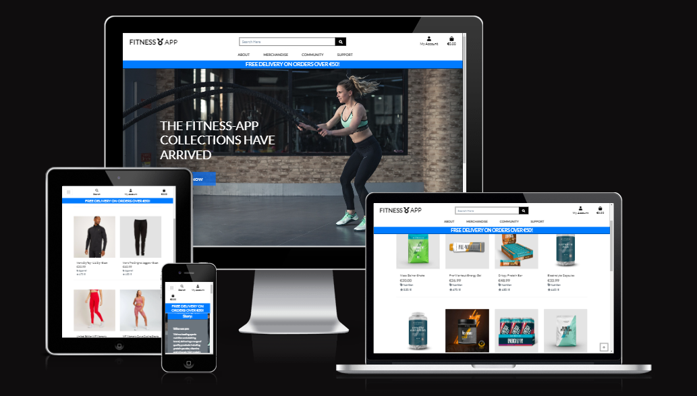
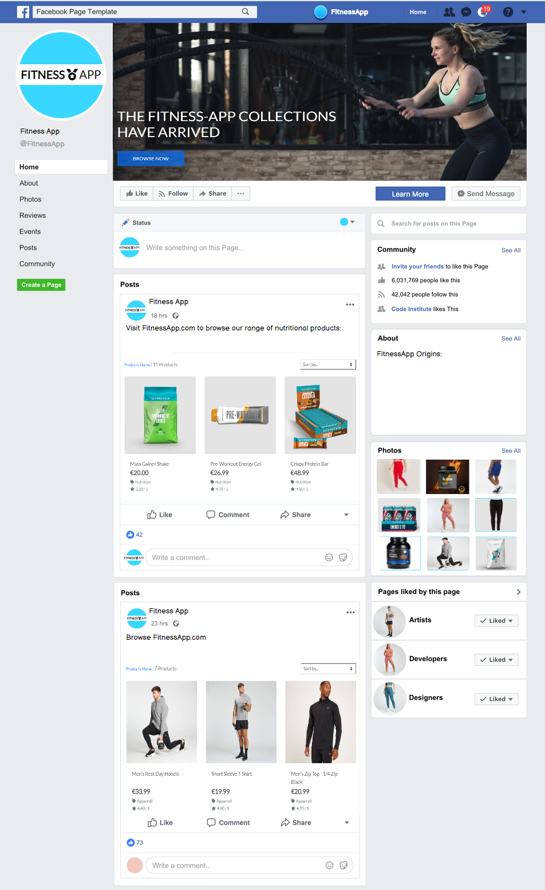
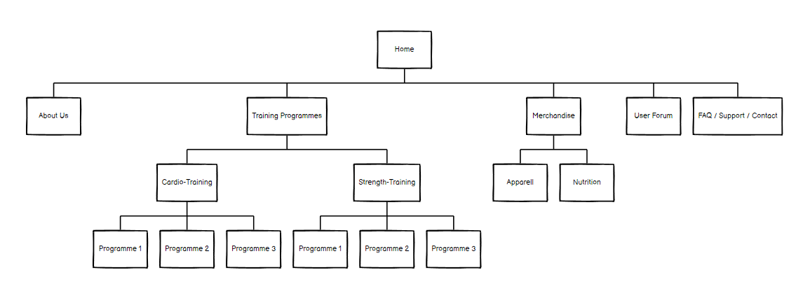

# Fitness App

 FitnessApp is a [Heroku deployed](https://fitness-app-p5.herokuapp.com/) Full-Stack E-commerce Application with authentication mechanisms & paid access to the site's merchandise. 

Business Model
Purpose of business, any marketing strategies - using facebook

# SECTION 1: UX

I have designed the site using the five planes of UX approach, each of which is reviewed in detail in the following sections

## 1. Strategy
The ecommerce strategy for the site is to offer a business-to-customer (B2C) resource to users interested in Fitness where they can purchase Clothing and Nutrition, and can have the ability to participate in a community discussing their own topics, comments, and replies and to engage within a broader community of members and customers.

As part of the E-Commerce strategy a facebook business page for the site has been designed and developed per below to aid with increasing the business' brand reach and to suuport with both developing new customers and retaining existing customers:

The strategic aim of the site is to deliver the following **Epics**:

1. Epic 1 - Create an Ecommerce Website App to allow users to purchase fitness apparrell and nutritional products
2. Epic 2 - Create a community within the website to enhance the business brand and encourage members to purchase more products from the store

With these two broad epics as the overall strategic goal of the project, we are then able to refine the epics into the following **User Stories**, each of which must have a clearly defined set of **Acceptance Criteria**:

### **Epic 1 - Ecommerce Website App - User Story Mapping:**

### *As a shopper I can:*
- View a list of products so that I can select some to purchase:
    - Acceptance Criteria:
        - 1 The product listing should display the products' price
        - 2 The product listing should display the products' name
        - 3 The product image should be clickable to bring the shopper to the individual product details

- View individual product details so that I can Identify the price, description, and product rating, product image and available sizes
    - Acceptance Criteria:
            - 1 The product details should contain an "add to bag" button allowing the shopper to add the product to their bag
            - 2 The image should be large enough to give the shopper a good feel for the item being assessed
            - 3 The product details screen should contain a more in-depth description of the item to give the shopper context and information on the product

- Easily view the total of my purchases at any time so that I can Avoid spending too much
    - Acceptance Criteria:
        - 1 The shopping bag link should be viewable at all times on all site pages with the bag's current total cost also displayed
        - 2 There should be a link to take the user to the secure checkout feature if the user has completed their shopping
        - 3 The shopper should be able to easily modify the quantity of an item in their bag, or delete the item if required
- Easily register for an account so that I can Have a personal account and be able to view my profile
    - Acceptance Criteria:
        - 1 The registration template should request an email, username and password
        - 2 Upon clicking on the signup button, a user should receive a confirmation that their account setup is underway
        - 3 The signup screen should also contain a direct link to the `Sign In` link, in case a user has arrived at the signup screen by mistake
- Easily login or logout so that I can Access my personal account information
    - Acceptance Criteria:
        - 1 The login screen should contain a forgot password option
        - 2 The login screen should also contain a "remember me" option and a direct link to the home page
        - 3 The login screen should function as expected
- Easily recover my password in case I forget it so that I can Recover access to my account
    - Acceptance Criteria:
        - 1 A "forgot password" option should be displayed on the login screen
        - 2 Upon clicking on the "forgot password" link - a user should be prompted to enter their email address
        - 3 The email should contain instructions on what user actions are required to reset their password
- Receive an email confirmation after registering so that I can Verify that my account registration was successful
    - Acceptance Criteria:
        - 1 The email should send automatically to the address specified in the user's signup details
        - 2 The email should include details of the user's username and the date & time
        - 3 The email should give the customer information on where they should go if they have queries on their account

- Have a personalised user profile so that I can View my personal order history and order confirmations, and save my payment information
    - Acceptance Criteria:
        - 1 The profile should provide fields for a user's default delivery information
        - 2 A history of the user's previous orders should also be shown wih dates and costs
        - 3 There should be an option for a user to update their information 

- Sort the list of available products so that I can Easily identify the best rated, best priced and categorically sorted products
    - Acceptance Criteria:
        - 1 Enable the user to sort by price (In both ascending & descending order)
        - 2 Enable the user to sort by name (in both directions)
        - 3 Enable the user to sort by category (both ascending and descending)
        
- Sort a specific category of product so that I can Find the best-priced or best-rated product in a specific category, or sort the products in that category by name
    - Acceptance Criteria:
        - 1 Enable the user to sort by price (In both ascending & descending order)
        - 2 Enable the user to sort by name (in both directions)
        - 3 Enable the user to sort by category (both ascending and descending)
        
- Sort multiple categories of products simulataneously so that I can Find the best-priced or best-rated product across broad categories such as "nutrition" or "apparrell"
    - Acceptance Criteria:
        - 1 The products should be displayed in their correct sequence upon completion of the search
        - 2 The search should be possible in either direction - ascending or descending
        - 3 The multiple category search should function as expected
        
- Search for a product by name or description so that I can Find a specific product I'd like to purchase
    - Acceptance Criteria:
        - 1 The search bar should be accessible at the top of all site pages
        - 2 The search bar should contain placeholder text "Search Here" and a search icon to promote a positive User Experience
        - 3 The search should return the correct listing of products
        
- Easily see what I've searched for and the number of results so that I can Quickly decide whether the product I want is available
    - Acceptance Criteria:
        - 1 The search results should be displayed on a new screen 
        - 2 Each product search result should be consistent with the original product listing style & layout
        - 3 The search results should enable the user to click into the detail of any of the products returned
        
- Easily select the size and quantity of a product when purchasing it so that I can Ensure I don't accidentally select the wrong product, quantity or size
    - Acceptance Criteria:
        - 1 The product detail screen should enable selection of product size and quantity
        - 2 The product size selector should be a drop-down menu listing all available sizes
        - 3 The Product quantity selector should be an incrementor allowing the user to enter quantities as required
        
- View items in my bag to be purchased so that I can Identify the total cost of my purchase and all items I will receive
    - Acceptance Criteria:
        - 1 The shopping bag screen should show a summary of the shopping bag contents
        - 2 The user should be able to update quantities of items in their shopping bag
        - 3 The user should also have the ability to remove items from their bag if they wish
        
- Adjust the quantity of individual items in my bag so that I can Easily make changes to my purchase before checkout
    - Acceptance Criteria:
        - 1 The quantity selector in the shopping bag should allow the user to either manually type or use a selector to specify the quantity
        - 2 The quantity selector should not accept bogus values (for example negative values)
        - 3 Upon update of the quantity, the shopping bag total should automatically update appropriately
        
- Easily enter my payment information so that I can Check out quickly and with no hassle
    - Acceptance Criteria:
        - 1 The payment card input details area should be intuitive and easy to use
        - 2 Appropriate error message guidance should be provided to the user in the event of incorrect details being supplied
        - 3 The "Complete Order" button should be easily viewable and work as intended
        
- Feel my personal and payment information is safe and secure so that I can Confidently provide the needed information to make a purchase
    - Acceptance Criteria:
        - 1 All user information should be password protected to ensure safety and confidentiality
        - 2 There should be an option for a user to "remember the details" so that their details pre-populate each time they make a purchase
        - 3 Placeholder text should be present in each field in the details section to allow for a positive UX
        
- View an order confirmation after checkout so that I can Verify that I haven't made any mistakes 
    - Acceptance Criteria:
        - 1 Display the order number and date
        - 2 The details of the products purchased should also be shown on the order confirmation
        - 3 Include the total price that was charged to the user's payment method, including the breakdown of delivery charges
        
- Receive an email confirmation after checking out so that I can Keep the confirmation of what I've purchased for my records
    - Acceptance Criteria:
        - 1 The email should send automatically in conjunction with the completion of the user's payment
        - 2 The email should include details of what the user has purchased and the date/time
        - 3 The email should give the customer information on where they should go if they have queries on their order

- Submit an enquiry to the store management about any issues or questions I may have relating to the site via the `Contact Us` page
    - Acceptance Criteria:
            - 1 The form should allow me to enter my name, email address, and provide the details of my enquiry
            - 2 The form should be available to anonymous shoppers/users, as well as users logged in
            - 3 If a user is logged in while accessing the form, their name & email should pre-populate (Positive UX)

- Sign Up to the Fitness App Newsletter by entering my details in the Newsletter form in the site footer
    - Acceptance Criteria:
            - 1 The form should allow me to enter my email address to specify where the newsletter should be sent
            - 2 I should have to consent to the site Privacy statement before being accepted into the newsletter distribution
            - 3 The signup form should be available on all site pages via the footer
        
### *As a store owner I can:*
- Add a product so that I can Add new items to my store
    - Acceptance Criteria:
        - 1 The interface should be on the front end (not the admin/back-end) and easy to use
        - 2 All appropriate product fields should be included in the form
        - 3 The screen should be appropriately protected to prevent unauthorised users from gaining access
        
- Edit/Update a product so that I can Change product Prices, descriptions, images, and other product criteria
    - Acceptance Criteria:
        - 1 The edit optiopn should be clearly visible beside each product
        - 2 The option should be viewable only to users with the correct level of authentication and authorisation
        - 3 There should also be an option for the user to cancel their update if it is no longer required
        
- Delete a product so that I can Remove items that are no longer for sale
    - Acceptance Criteria:
        - 1 The delete option should be clearly visible beside each product
        - 2 The option should be viewable only to users with the correct level of authentication and authorisation
        - 3 As part of defensive design principles - There should be a warning presented to a user upon selecting the deletion option to prevent inadvertent deletion

- View a list of enquiries submitted via the `Contact Us` form page
    - Acceptance Criteria:
        - 1 The enquiry log should be secured and protected against unauthorised access
        - 2 Each enquiry should be shown along with the key fields and data
        - 3 There should be an option to mark an enquiry as "closed" upon successfully actioning it

### **Epic 2 - Fitness App Community - User Story Mapping:**

### *As a forum member I can:*
- View a list of current discussion topics so that I can Easily see the extent of discussion topics available on the forum
    - Acceptance Criteria:
        - 1 The list should show each topic title, author and creation date
        - 2 The list should be paginated to prevent excessive quantities of topics and scrolling
        - 3 Each topic should contain a number of actions the user is permitted to undertake depending on their authorisation & authentication level

- View a list of comments and replies so that I can See how the discussion has progressed to date to determine what I should add to the topic
    - Acceptance Criteria:
        - 1 I should be able to access the list of comments and replies by clicking on the topic title
        - 2 The comment/reply detail (topic detail) screen should show me each comment and reply along with author and date
        - 3 My permitted CRUD actions should be displayed 
        - 4 The list of comments & replies should be paginated to prevent excessive scrolling for the user

- View a record of my forum actvities  so that I can Easily see my activity in terms of topics I have created, as well as comments and replies I have left
    - Acceptance Criteria:
        - 1 The activity summary should show a list of all topics created by the user, together with key details and permitted CRUD actions
        - 2 A list of all comments left by the user, together with key details and permitted CRUD actions should also be shown
        - 3 The activity summary should show a list of all replies left by the user, together with key details and permitted CRUD actions
        - 4 All lists should be appropriately paginated

- Create a discussion topic so that I can Get advice and input from other members and customers on the topic
    - Acceptance Criteria:
        - 1 The button to create a topic should be clearly shown to the user at the top of the forum welcome page
        - 2 This should bring the user to a new form prompting the user to enter their topic title
        - 3 As part of defensive design principles, the field should not permit blank values before submission

- Edit a discussion topic so that I can Remove typographical errors or change an out of date subject
    - Acceptance Criteria:
        - 1 I should only be permitted to edit topics which I have created
        - 2 The edit topic form should give me a field to change the topic title
        - 3 The field should pre-populate the previous title to promote a positive UX 

- Delete a discussion topic so that I can Remove the topic from the website if required
    - Acceptance Criteria:
        - 1 I should only be permitted to delete topics which I have created
        - 2 There should be a warning presented upon clicking the delete button to ensure the deletion is warranted
        - 3 Upon deletion of the topic, all associated comments and replies should also be deleted

- Create a comment so that I can Add a comment to a discussion topic created by myself or others
    - Acceptance Criteria:
        - 1 The button to create a comment should be clearly shown to the user at the top of the Topic Detail page
        - 2 This should bring the user to a new form prompting the user to add their comment content
        - 3 As part of defensive design principles, the field should not permit blank values before submission

- Edit a comment so that I can Add or remove content from my original comment or correct errors
    - Acceptance Criteria:
        - 1 I should only be permitted to edit comments which I have created
        - 2 The edit comment form should give me a field to change the comment content
        - 3 The field should pre-populate the previous comment to promote a positive UX 

- Delete a comment so that I can Remove the comment from the website if required
    - Acceptance Criteria:
        - 1 I should only be permitted to delete comments which I have created
        - 2 There should be a warning presented upon clicking the delete button to ensure the deletion is warranted
        - 3 Upon deletion of the comment, all associated replies should also be deleted

- Create a reply so that I can Reply to a comment in a discussion topic created by myself or others
    - Acceptance Criteria:
        - 1 The button to create a reply should be clearly shown to the user in the actions field of the comment detail
        - 2 This should bring the user to a new form prompting the user to add their reply content
        - 3 As part of defensive design principles, the field should not permit blank values before submission

- Edit a reply so that I can Add or remove content from my original reply or correct errors
    - Acceptance Criteria:
        - 1 I should only be permitted to edit replies which I have created
        - 2 The edit reply form should give me a field to change the reply content
        - 3 The field should pre-populate the previous comment to promote a positive UX 

- Delete a reply so that I can Remove the reply from the website if required
    - Acceptance Criteria:
        - 1 I should only be permitted to delete replies which I have created
        - 2 There should be a warning presented upon clicking the delete button to ensure the deletion is warranted
        - 3 Upon deletion of the reply, the parent comment and topic should be un-impacted

## Scope

To deliver the scope of the project, an Agile approach to Software Development has been pursued for the project implementation. There are many useful resources available giving context and perspectives on the advantages of an Agile Software Development practice - including the Agilemanifesto.org and Agilealliance.org which are good starting points, and summarise Agile Software Development as "Individuals and interactions over processes and tools, Working software over comprehensive documentation, Customer collaboration over contract negotiation, and Responding to change over following a plan"

There are many principles and features common to Agile approaches, including, Scrums, Sprints, and Kanban boards - I am currently managing the project scope via multiple kanban boards using Github's built-in Kanban board functionality, with a board for managing the delivery of user stories, and a board for managing the bugs & debugging exercises through the development lifecycle. And work through daily sprints in taking each of the tasks through their stages of completion:

A view of the Kanban board with the user stories having been brought through "To Do", "In Progress", and "Done" columns as follows:

### Kanban Board
### Tasks

## Structure
### Project Structure - Site Layout:

### **Project Structure - Models**

<table>
    <thead>
        <tr>
            <th>App/s</th>
            <th>Model/s</th>
            <th>Custom Model?</th>
            <th>Notes</th>
        </tr>
    </thead>
    <tbody>
        <tr>
            <td>Home</td>
            <td>-</td>
            <td>-</td>
            <td>-</td>
        </tr>
        <tr>
            <td rowspan=3>Products</td>
            <td>Category</td>
            <td>N</td>
            <td>1. Apparrell 2. Nutrition 3. Cardio-Programme 4. Strength-Programme</td>
        </tr>
        <tr>
            <td>Product</td>
            <td>N</td>
            <td> ~10 Apparrell products & ~10 Nutrition products</td>
        </tr>
        <tr>
            <td>Programme</td>
            <td>Y</td>
            <td>6 programmes (Beginner, Intermediate & Advanced for Cardio-Programmes & Strength-Programmes)</td>
        </tr>
        <tr>
            <td rowspan=2>Checkout</td>
            <td>Order</td>
            <td>N</td>
            <td>-</td>
        </tr>
        <tr>
            <td>OrderLineItem</td>
            <td>N</td>
            <td>-</td>
        </tr>
        <tr>
            <td>Bag</td>
            <td>-</td>
            <td>-</td>
            <td>-</td>
        </tr>
        <tr>
            <td rowspan=2>Profile</td>
            <td>UserProfile</td>
            <td>N</td>
            <td>-</td>
        </tr>
        <tr>
            <td>create_or_update_user_profile</td>
            <td>N</td>
            <td>-</td>
        </tr>
        <tr>
            <td rowspan=3>Forum</td>
            <td>Section</td>
            <td>Y</td>
            <td>e.g. General, Announcements, etc - only an admin can create/delete</td>
        </tr>
        <tr>
            <td>Topic (Sits within a Section </td>
            <td>Y</td>
            <td>e.g. in general: Welcome to Forum, Forum Rules & guidelines... Users can also create A topic - e.g. "What Programme should I use?")</td>
        </tr>
        <tr>
            <td>Post </td>
            <td>Y</td>
            <td>(Users can post within a topic - and can also create, read, edit & delete their own posts)</td>
        </tr>
        <tr>
            <td>Contact</td>
            <td>Enquiry</td>
            <td>Y</td>
            <td>Contact Us section - users can populate & submit a form with their queries if not answered by existing FAQs</td>
        </tr>
    </tbody>
</table>

### **Project Structure - Forms**

<table>
    <thead>
        <tr>
            <th>App/s</th>
            <th>Form/s</th>
            <th>Custom Form?</th>
        </tr>
    </thead>
    <tbody>
        <tr>
            <td>Home</td>
            <td>-</td>
            <td>-</td>
        </tr>
        <tr>
            <td rowspan=2>Products</td>
            <td>ProductForm</td>
            <td>N</td>
        </tr>
        <tr>
            <td>ProgrammeForm</td>
            <td>Y</td>
        </tr>
        <tr>
            <td>Checkout</td>
            <td>OrderForm</td>
            <td>N</td>
        </tr>
        <tr>
            <td>Bag</td>
            <td>-</td>
            <td>-</td>
        </tr>
        <tr>
            <td>Profile</td>
            <td>UserProfileForm</td>
            <td>N</td>
        </tr>
        <tr>
            <td rowspan=3>Forum</td>
            <td>SubForumForm</td>
            <td>Y</td>
        </tr>
        <tr>
            <td>TopicForm</td>
            <td>Y</td>
        </tr>
        <tr>
            <td>PostForm</td>
            <td>Y</td>
        </tr>
        <tr>
            <td>Contact</td>
            <td>EnquiryForm</td>
            <td>Y</td>
        </tr>
    </tbody>
</table>

## Skeleton
## Surface
# Features

# Testing
## Manual Testing
## Automated Testing

# Bugs
## Resolved Bugs
## Unresolved Bugs

# Deployment
## Github Deployment
## Amazon AWS Deployment
## Heroku Deployment
## Local Deployment

# Credits
## General
## Content
## Code
## Media