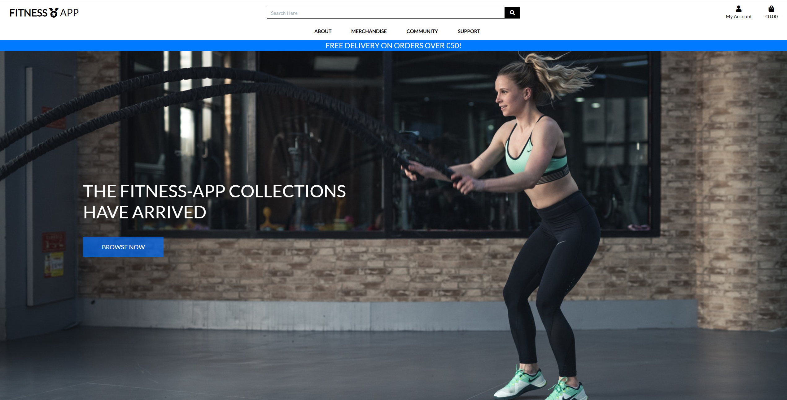

# Fitness App

 Heroku deployed (deployment link [here](https://fitness-app-p5.herokuapp.com/)) Full-Stack E-commerce Application with authentication mechanism & paid access to the site's merchandise and workout programmes

# UX

## Strategy
### Epics
### User Stories

## Scope
### Kanban Board
### Tasks

## Structure
### Project Structure - Site Layout:

### **Project Structure - Models**

<table>
    <thead>
        <tr>
            <th>App/s</th>
            <th>Model/s</th>
            <th>Custom Model?</th>
            <th>Notes</th>
        </tr>
    </thead>
    <tbody>
        <tr>
            <td>Home</td>
            <td>-</td>
            <td>-</td>
            <td>-</td>
        </tr>
        <tr>
            <td rowspan=3>Products</td>
            <td>Category</td>
            <td>N</td>
            <td>1. Apparrell 2. Nutrition 3. Cardio-Programme 4. Strength-Programme</td>
        </tr>
        <tr>
            <td>Product</td>
            <td>N</td>
            <td> ~10 Apparrell products & ~10 Nutrition products</td>
        </tr>
        <tr>
            <td>Programme</td>
            <td>Y</td>
            <td>6 programmes (Beginner, Intermediate & Advanced for Cardio-Programmes & Strength-Programmes)</td>
        </tr>
        <tr>
            <td rowspan=2>Checkout</td>
            <td>Order</td>
            <td>N</td>
            <td>-</td>
        </tr>
        <tr>
            <td>OrderLineItem</td>
            <td>N</td>
            <td>-</td>
        </tr>
        <tr>
            <td>Bag</td>
            <td>-</td>
            <td>-</td>
            <td>-</td>
        </tr>
        <tr>
            <td rowspan=2>Profile</td>
            <td>UserProfile</td>
            <td>N</td>
            <td>-</td>
        </tr>
        <tr>
            <td>create_or_update_user_profile</td>
            <td>N</td>
            <td>-</td>
        </tr>
        <tr>
            <td rowspan=3>Forum</td>
            <td>Section</td>
            <td>Y</td>
            <td>e.g. General, Announcements, etc - only an admin can create/delete</td>
        </tr>
        <tr>
            <td>Topic (Sits within a Section </td>
            <td>Y</td>
            <td>e.g. in general: Welcome to Forum, Forum Rules & guidelines... Users can also create A topic - e.g. "What Programme should I use?")</td>
        </tr>
        <tr>
            <td>Post </td>
            <td>Y</td>
            <td>(Users can post within a topic - and can also create, read, edit & delete their own posts)</td>
        </tr>
        <tr>
            <td>Contact</td>
            <td>Enquiry</td>
            <td>Y</td>
            <td>Contact Us section - users can populate & submit a form with their queries if not answered by existing FAQs</td>
        </tr>
    </tbody>
</table>

### **Project Structure - Forms**

<table>
    <thead>
        <tr>
            <th>App/s</th>
            <th>Form/s</th>
            <th>Custom Form?</th>
        </tr>
    </thead>
    <tbody>
        <tr>
            <td>Home</td>
            <td>-</td>
            <td>-</td>
        </tr>
        <tr>
            <td rowspan=2>Products</td>
            <td>ProductForm</td>
            <td>N</td>
        </tr>
        <tr>
            <td>ProgrammeForm</td>
            <td>Y</td>
        </tr>
        <tr>
            <td>Checkout</td>
            <td>OrderForm</td>
            <td>N</td>
        </tr>
        <tr>
            <td>Bag</td>
            <td>-</td>
            <td>-</td>
        </tr>
        <tr>
            <td>Profile</td>
            <td>UserProfileForm</td>
            <td>N</td>
        </tr>
        <tr>
            <td rowspan=3>Forum</td>
            <td>SubForumForm</td>
            <td>Y</td>
        </tr>
        <tr>
            <td>TopicForm</td>
            <td>Y</td>
        </tr>
        <tr>
            <td>PostForm</td>
            <td>Y</td>
        </tr>
        <tr>
            <td>Contact</td>
            <td>EnquiryForm</td>
            <td>Y</td>
        </tr>
    </tbody>
</table>

## Skeleton
## Surface
# Features

# Testing
## Manual Testing
## Automated Testing

# Bugs
## Resolved Bugs
## Unresolved Bugs

# Deployment
## Github Deployment
## Amazon AWS Deployment
## Heroku Deployment
## Local Deployment

# Credits
## General
## Content
## Code
## Media