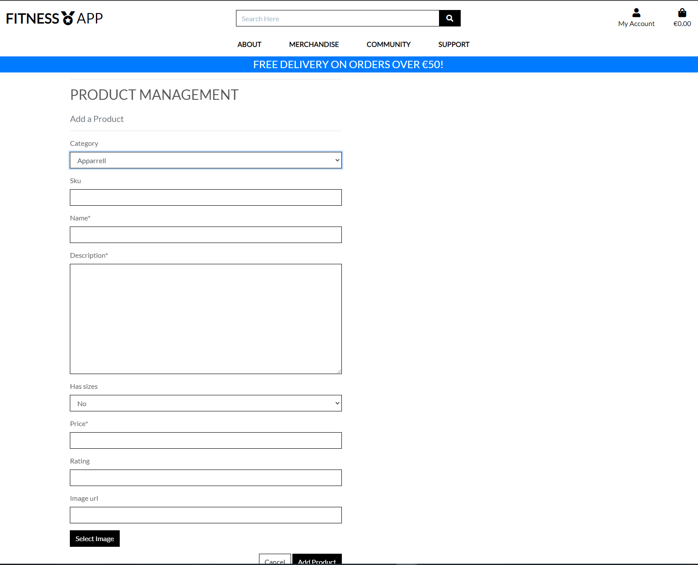
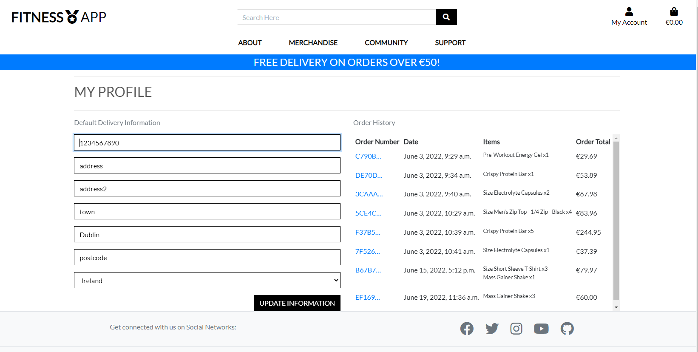
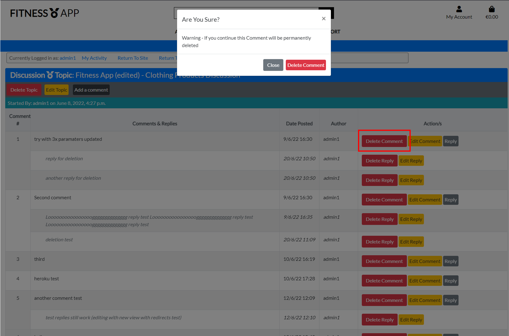
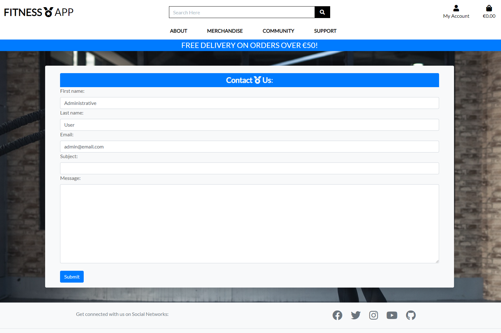
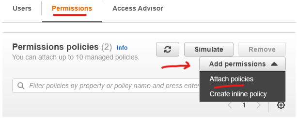
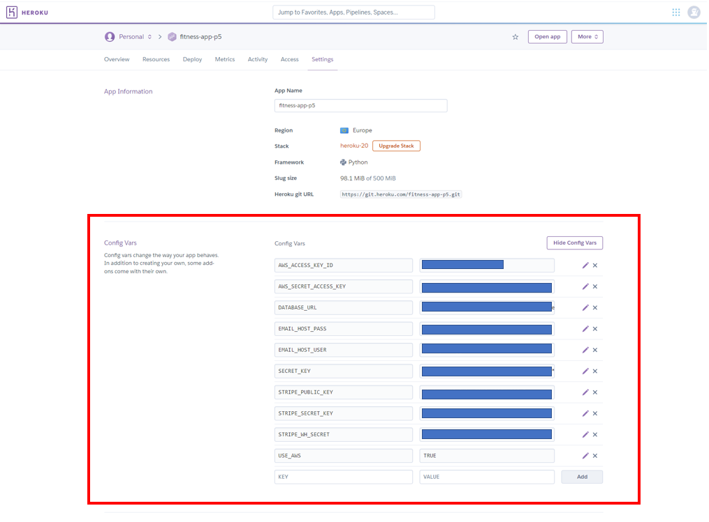

# Fitness App

 FitnessApp is a [Heroku deployed](https://fitness-app-p5.herokuapp.com/) Full-Stack E-commerce Application with authentication mechanisms & paid access to the site's merchandise. 


# SECTION 1: UX

I have designed the site using the five planes of UX approach, each of which is reviewed in detail in the following sections

## 1. Strategy

- E-Commerce Strategy & Business Model:

`Pass Criteria: LO6: 7.1 - Document the e-commerce business model underlying your application`

The ecommerce strategy for the site is to offer a business-to-customer (B2C) resource to users interested in Fitness where they can purchase Clothing and Nutrition, and can have the ability to participate in a community discussing their own topics, comments, and replies and to engage within a broader community of members and customers.

- Marketing Strategy:

`Merit Criteria: 5.1 - Document the primary marketing strategy behind the application`

As part of the primary marketing strategy, a facebook business page for the site has been designed and developed per below to aid with increasing the business' brand reach and to suuport with both developing new customers and retaining existing customers. Facebook are currently deleting many business pages so the screenshot below is attached as a record in case of deletion:


## Scope

The Scope of the site is broadly encompassed in the delivery of the following **Epics**:

1. Epic 1 - Create an Ecommerce Website App to allow users to purchase fitness apparrell and nutritional products
2. Epic 2 - Create a community within the website to enhance the business brand and encourage members to purchase more products from the store

With these two broad epics as the overall strategic goal of the project, we are then able to refine the epics into the following **User Stories**, each of which must have a clearly defined set of **Acceptance Criteria**

To deliver the scope of the project, an Agile approach to Software Development has been pursued for the project implementation. There are many useful resources available giving context and perspectives on the advantages of an Agile Software Development practice - including the Agilemanifesto.org and Agilealliance.org which are good starting points, and summarise Agile Software Development as "Individuals and interactions over processes and tools, Working software over comprehensive documentation, Customer collaboration over contract negotiation, and Responding to change over following a plan"

There are many principles and features common to Agile approaches, including, Scrums, Sprints, and Kanban boards - I am currently managing the project scope via multiple kanban boards using Github's built-in Kanban board functionality, with a board for managing the delivery of user stories, and a board for managing the bugs & debugging exercises through the development lifecycle. And work through daily sprints in taking each of the tasks through their stages of completion.

A view of the Kanban board with the user stories having been brought through "To Do", "In Progress", and "Done" columns as follows:

### (i) Kanban Board 1 (Epic 1 Scope): [Link](https://github.com/dkelly255/fitness-app/projects/1)


Each of the User Stories in Epic #1 are detailed below, together with their individual specific acceptance criteria and descriptions, from the perspcetives of both a shopper, and a store owner:

### **Epic 1 - Ecommerce Website App - User Story Mapping:**

### *As a shopper I can:*
- View a list of products so that I can select some to purchase:
    - Acceptance Criteria:
        - 1 The product listing should display the products' price
        - 2 The product listing should display the products' name
        - 3 The product image should be clickable to bring the shopper to the individual product details

- View individual product details so that I can Identify the price, description, and product rating, product image and available sizes
    - Acceptance Criteria:
            - 1 The product details should contain an "add to bag" button allowing the shopper to add the product to their bag
            - 2 The image should be large enough to give the shopper a good feel for the item being assessed
            - 3 The product details screen should contain a more in-depth description of the item to give the shopper context and information on the product

- Easily view the total of my purchases at any time so that I can Avoid spending too much
    - Acceptance Criteria:
        - 1 The shopping bag link should be viewable at all times on all site pages with the bag's current total cost also displayed
        - 2 There should be a link to take the user to the secure checkout feature if the user has completed their shopping
        - 3 The shopper should be able to easily modify the quantity of an item in their bag, or delete the item if required
- Easily register for an account so that I can Have a personal account and be able to view my profile
    - Acceptance Criteria:
        - 1 The registration template should request an email, username and password
        - 2 Upon clicking on the signup button, a user should receive a confirmation that their account setup is underway
        - 3 The signup screen should also contain a direct link to the `Sign In` link, in case a user has arrived at the signup screen by mistake
- Easily login or logout so that I can Access my personal account information
    - Acceptance Criteria:
        - 1 The login screen should contain a forgot password option
        - 2 The login screen should also contain a "remember me" option and a direct link to the home page
        - 3 The login screen should function as expected
- Easily recover my password in case I forget it so that I can Recover access to my account
    - Acceptance Criteria:
        - 1 A "forgot password" option should be displayed on the login screen
        - 2 Upon clicking on the "forgot password" link - a user should be prompted to enter their email address
        - 3 The email should contain instructions on what user actions are required to reset their password
- Receive an email confirmation after registering so that I can Verify that my account registration was successful
    - Acceptance Criteria:
        - 1 The email should send automatically to the address specified in the user's signup details
        - 2 The email should include details of the user's username and the date & time
        - 3 The email should give the customer information on where they should go if they have queries on their account

- Have a personalised user profile so that I can View my personal order history and order confirmations, and save my payment information
    - Acceptance Criteria:
        - 1 The profile should provide fields for a user's default delivery information
        - 2 A history of the user's previous orders should also be shown wih dates and costs
        - 3 There should be an option for a user to update their information 

- Sort the list of available products so that I can Easily identify the best rated, best priced and categorically sorted products
    - Acceptance Criteria:
        - 1 Enable the user to sort by price (In both ascending & descending order)
        - 2 Enable the user to sort by name (in both directions)
        - 3 Enable the user to sort by category (both ascending and descending)
        
- Sort a specific category of product so that I can Find the best-priced or best-rated product in a specific category, or sort the products in that category by name
    - Acceptance Criteria:
        - 1 Enable the user to sort by price (In both ascending & descending order)
        - 2 Enable the user to sort by name (in both directions)
        - 3 Enable the user to sort by category (both ascending and descending)
        
- Sort multiple categories of products simulataneously so that I can Find the best-priced or best-rated product across broad categories such as "nutrition" or "apparrell"
    - Acceptance Criteria:
        - 1 The products should be displayed in their correct sequence upon completion of the search
        - 2 The search should be possible in either direction - ascending or descending
        - 3 The multiple category search should function as expected
        
- Search for a product by name or description so that I can Find a specific product I'd like to purchase
    - Acceptance Criteria:
        - 1 The search bar should be accessible at the top of all site pages
        - 2 The search bar should contain placeholder text "Search Here" and a search icon to promote a positive User Experience
        - 3 The search should return the correct listing of products
        
- Easily see what I've searched for and the number of results so that I can Quickly decide whether the product I want is available
    - Acceptance Criteria:
        - 1 The search results should be displayed on a new screen 
        - 2 Each product search result should be consistent with the original product listing style & layout
        - 3 The search results should enable the user to click into the detail of any of the products returned
        
- Easily select the size and quantity of a product when purchasing it so that I can Ensure I don't accidentally select the wrong product, quantity or size
    - Acceptance Criteria:
        - 1 The product detail screen should enable selection of product size and quantity
        - 2 The product size selector should be a drop-down menu listing all available sizes
        - 3 The Product quantity selector should be an incrementor allowing the user to enter quantities as required
        
- View items in my bag to be purchased so that I can Identify the total cost of my purchase and all items I will receive
    - Acceptance Criteria:
        - 1 The shopping bag screen should show a summary of the shopping bag contents
        - 2 The user should be able to update quantities of items in their shopping bag
        - 3 The user should also have the ability to remove items from their bag if they wish
        
- Adjust the quantity of individual items in my bag so that I can Easily make changes to my purchase before checkout
    - Acceptance Criteria:
        - 1 The quantity selector in the shopping bag should allow the user to either manually type or use a selector to specify the quantity
        - 2 The quantity selector should not accept bogus values (for example negative values)
        - 3 Upon update of the quantity, the shopping bag total should automatically update appropriately
        
- Easily enter my payment information so that I can Check out quickly and with no hassle
    - Acceptance Criteria:
        - 1 The payment card input details area should be intuitive and easy to use
        - 2 Appropriate error message guidance should be provided to the user in the event of incorrect details being supplied
        - 3 The "Complete Order" button should be easily viewable and work as intended
        
- Feel my personal and payment information is safe and secure so that I can Confidently provide the needed information to make a purchase
    - Acceptance Criteria:
        - 1 All user information should be password protected to ensure safety and confidentiality
        - 2 There should be an option for a user to "remember the details" so that their details pre-populate each time they make a purchase
        - 3 Placeholder text should be present in each field in the details section to allow for a positive UX
        
- View an order confirmation after checkout so that I can Verify that I haven't made any mistakes 
    - Acceptance Criteria:
        - 1 Display the order number and date
        - 2 The details of the products purchased should also be shown on the order confirmation
        - 3 Include the total price that was charged to the user's payment method, including the breakdown of delivery charges
        
- Receive an email confirmation after checking out so that I can Keep the confirmation of what I've purchased for my records
    - Acceptance Criteria:
        - 1 The email should send automatically in conjunction with the completion of the user's payment
        - 2 The email should include details of what the user has purchased and the date/time
        - 3 The email should give the customer information on where they should go if they have queries on their order

- Submit an enquiry to the store management so that I can get support for any issues or questions I may have relating to the site via the `Contact Us` page
    - Acceptance Criteria:
            - 1 The form should allow me to enter my name, email address, and provide the details of my enquiry
            - 2 The form should be available to anonymous shoppers/users, as well as users logged in
            - 3 If a user is logged in while accessing the form, their name & email should pre-populate (Positive UX)

- Sign Up to the Fitness App Newsletter so that I can get information on deals and offers by entering my details in the Newsletter form in the site footer
    - Acceptance Criteria:
            - 1 The form should allow me to enter my email address to specify where the newsletter should be sent
            - 2 I should have to consent to the site Privacy statement before being accepted into the newsletter distribution
            - 3 The signup form should be available on all site pages via the footer
        
### *As a store owner I can:*
- Add a product so that I can Add new items to my store
    - Acceptance Criteria:
        - 1 The interface should be on the front end (not the admin/back-end) and easy to use
        - 2 All appropriate product fields should be included in the form
        - 3 The screen should be appropriately protected to prevent unauthorised users from gaining access
        
- Edit/Update a product so that I can Change product Prices, descriptions, images, and other product criteria
    - Acceptance Criteria:
        - 1 The edit optiopn should be clearly visible beside each product
        - 2 The option should be viewable only to users with the correct level of authentication and authorisation
        - 3 There should also be an option for the user to cancel their update if it is no longer required
        
- Delete a product so that I can Remove items that are no longer for sale
    - Acceptance Criteria:
        - 1 The delete option should be clearly visible beside each product
        - 2 The option should be viewable only to users with the correct level of authentication and authorisation
        - 3 As part of defensive design principles - There should be a warning presented to a user upon selecting the deletion option to prevent inadvertent deletion

- View a list of enquiries submitted so that I can address and manage them via the `Contact Us` form page
    - Acceptance Criteria:
        - 1 The enquiry log should be secured and protected against unauthorised access
        - 2 Each enquiry should be shown along with the key fields and data
        - 3 There should be an option to mark an enquiry as "closed" upon successfully actioning it

Additionally - From a further Agile development perspective, the User Stories are also classified using the MoSCoW prioritisation technique, with each user story being attributed a category in terms of being either `Must-Have`, `Should-Have`, `Could-Have` and `Won't-Have`:


### (ii) Kanban Board 2 - User Stories [Link](https://github.com/dkelly255/fitness-app/projects/2)


Each of the User Stories in Epic #2 are detailed below, together with their individual specific acceptance criteria and descriptions, from the perspcetives of a community/forum member:

### **Epic 2 - Fitness App Community - User Story Mapping:**

### *As a forum member I can:*
- View a list of current discussion topics so that I can Easily see the extent of discussion topics available on the forum
    - Acceptance Criteria:
        - 1 The list should show each topic title, author and creation date
        - 2 The list should be paginated to prevent excessive quantities of topics and scrolling
        - 3 Each topic should contain a number of actions the user is permitted to undertake depending on their authorisation & authentication level

- View a list of comments and replies so that I can See how the discussion has progressed to date to determine what I should add to the topic
    - Acceptance Criteria:
        - 1 I should be able to access the list of comments and replies by clicking on the topic title
        - 2 The comment/reply detail (topic detail) screen should show me each comment and reply along with author and date
        - 3 My permitted CRUD actions should be displayed 
        - 4 The list of comments & replies should be paginated to prevent excessive scrolling for the user

- View a record of my forum actvities so that I can Easily see my activity in terms of topics I have created, as well as comments and replies I have left
    - Acceptance Criteria:
        - 1 The activity summary should show a list of all topics created by the user, together with key details and permitted CRUD actions
        - 2 A list of all comments left by the user, together with key details and permitted CRUD actions should also be shown
        - 3 The activity summary should show a list of all replies left by the user, together with key details and permitted CRUD actions
        - 4 All lists should be appropriately paginated

- Create a discussion topic so that I can Get advice and input from other members and customers on the topic
    - Acceptance Criteria:
        - 1 The button to create a topic should be clearly shown to the user at the top of the forum welcome page
        - 2 This should bring the user to a new form prompting the user to enter their topic title
        - 3 As part of defensive design principles, the field should not permit blank values before submission

- Edit a discussion topic so that I can Remove typographical errors or change an out of date subject
    - Acceptance Criteria:
        - 1 I should only be permitted to edit topics which I have created
        - 2 The edit topic form should give me a field to change the topic title
        - 3 The field should pre-populate the previous title to promote a positive UX 

- Delete a discussion topic so that I can Remove the topic from the website if required
    - Acceptance Criteria:
        - 1 I should only be permitted to delete topics which I have created
        - 2 There should be a warning presented upon clicking the delete button to ensure the deletion is warranted
        - 3 Upon deletion of the topic, all associated comments and replies should also be deleted

- Create a comment so that I can Add a comment to a discussion topic created by myself or others
    - Acceptance Criteria:
        - 1 The button to create a comment should be clearly shown to the user at the top of the Topic Detail page
        - 2 This should bring the user to a new form prompting the user to add their comment content
        - 3 As part of defensive design principles, the field should not permit blank values before submission

- Edit a comment so that I can Add or remove content from my original comment or correct errors
    - Acceptance Criteria:
        - 1 I should only be permitted to edit comments which I have created
        - 2 The edit comment form should give me a field to change the comment content
        - 3 The field should pre-populate the previous comment to promote a positive UX 

- Delete a comment so that I can Remove the comment from the website if required
    - Acceptance Criteria:
        - 1 I should only be permitted to delete comments which I have created
        - 2 There should be a warning presented upon clicking the delete button to ensure the deletion is warranted
        - 3 Upon deletion of the comment, all associated replies should also be deleted

- Create a reply so that I can Reply to a comment in a discussion topic created by myself or others
    - Acceptance Criteria:
        - 1 The button to create a reply should be clearly shown to the user in the actions field of the comment detail
        - 2 This should bring the user to a new form prompting the user to add their reply content
        - 3 As part of defensive design principles, the field should not permit blank values before submission

- Edit a reply so that I can Add or remove content from my original reply or correct errors
    - Acceptance Criteria:
        - 1 I should only be permitted to edit replies which I have created
        - 2 The edit reply form should give me a field to change the reply content
        - 3 The field should pre-populate the previous comment to promote a positive UX 

- Delete a reply so that I can Remove the reply from the website if required
    - Acceptance Criteria:
        - 1 I should only be permitted to delete replies which I have created
        - 2 There should be a warning presented upon clicking the delete button to ensure the deletion is warranted
        - 3 Upon deletion of the reply, the parent comment and topic should be un-impacted

Additionally, each individual User Story on the board can be drilled into for a detailed description of both the User Story and the clearly defined acceptance criteria associated with the atomic scope being implemented via that User Story - an example is shown below:


### Tasks

## Structure

The website is structured using the Django Framework functionality, pages for an overview of the site (About Us), Merchandise, the Community section and the Support section. The home page greets the visitor with a welcome message and links to the main Merchandise content of the site via the `Browse Now` button, the Merchandise page houses products currently available to purchase from the site.

The core website data will be stored in a PostgreSQL Database, and website static files and media/images will be stored on the Amazon AWS Platform, with the app being deployed via Heroku. 

## Code Structure

### - *Model, View, Template*

Generically the project is structured using the "Model, View, Template" software design pattern. 

- The Model supports with database management, being a data access layer which primarily handles data. 
- The Views are used to execute the business logic and interact with the model to carry data and render a template
- The Templates are the presentation layers, which handle the User Interface aspects of the application.

The diagram below (sourced from [Towards-Data-Science](https://towardsdatascience.com/working-structure-of-django-mtv-architecture-a741c8c64082)) illustrates the MVT structure & control flow used for this project:


### - *Requirements.txt* 

The project structure includes a requirements.txt in keeping with Python Standards & best practices - as per this overview from [idkrtm.com](https://www.idkrtm.com/what-is-the-python-requirements-txt/), the requirements.txt file is used for specifying which Python packages are required to run the overall project.

The current packages and dependencies list for the project are shown below:


### - *Procfile*

A Procfile is also an integral element of the project structure - as per the overview in [medium.com](https://medium.com/@bennettgarner/deploying-django-to-heroku-procfile-static-root-other-pitfalls-e7ab8b2ba33b) - the Procfile is a file in the project's root directory that tells Heroku how the application should start and run - in this case, via a Gunicorn server.


## Database Structure & Schema

The Database schema is mapped below - the application will contain eleven Models across six Apps - The diagram illustrates each App, Model, and field, with the relationships between each entity also shown where certain models have Foreign Keys to other models.


### - Production Database - PostgreSQL:

[PostgreSQL](https://www.postgresql.org/) is the database system used for the models in production - As illustrated in this overview at [postgresqltutorial.com](https://www.postgresqltutorial.com/what-is-postgresql/) - PostgreSQL is an advanced, enterprise-class, open-source relational database system, which supports both relational querying, and is compatible with most popular programming languages (including Python) and is therefore ideal for the requirements of this project.

### - Development Database - SQLite3:

[SQLite3](https://www.sqlite.org/index.html) is the database system used for the models in testing and development - As illustrated in this overview at [Python.org](https://docs.python.org/3/library/sqlite3.html) - SQLite3 a C library that provides a lightweight disk-based database that doesn’t require a separate server process and allows accessing the database using a nonstandard variant of the SQL query language, and is typically used in Django Applications for testing & development.

### - Crispy Forms

The project structure also utilises an application known as [CrispyForms](https://django-crispy-forms.readthedocs.io/en/latest/) to enable controlling the rendering behaviour of the key forms within the application.

As per this overview article at [merixstudio.com](https://www.merixstudio.com/blog/django-crispy-forms-what-are-they-about/) Django-crispy-forms is an application that helps to manage Django forms and allows adjusting forms' properties (such as method, send button or CSS classes) on the backend without having to re-write them in the template.

## 4. Skeleton

The wireframes below illustrate the skeleton of the site, including the home page, login page, signup page, together with the various nav bars and footers that underpin the site structure:

- Wireframe 1 - Home Page


- Wireframe 2 - Merchandise


- Wireframe 3 - Discussion Forum


- Wireframe 4 - Support


- Wireframe 5 - Shopping Bag


- Wireframe 6 - Checkout


## 5. Surface

I have used the Bootstrap framework to build the Surface of the website, with the following design choices helping to deliver the optimum user experience:

- Typography

For the Fonts on the site I am primarily using [Lato](https://fonts.google.com/specimen/Lato?query=lato) for site content - As per the overview on Google Fonts [linked](https://fonts.google.com/specimen/Lato?query=lato), is a sans serif typeface family started in the summer of 2010 by Warsaw-based designer Łukasz Dziedzic (“Lato” means “Summer” in Polish):


- Color Palette

As part of the surface layer of the website's user experience, I wanted to use a Blue color palette as part of the site's theme - Bootstrap has a large array of color-schemes & themes to choose from, illustrated in the screenshot below:


A deeper dive on the Blue color scheme allows many different shades, hues, and opacities depending on the user's needs, for the majority of the site's surface I am using the default shade of Blue (code #0d6efd & its' derivations) - shown below:


- Imagery

I am using Fitness-related imagery throughout the Surface layer of the site, to help with promoting a positive User Experience for the target audience. The imagery is primarily consisted of different exercise-related pictures & illustrations. The site's background image is also selected due to it's relevance to fitness/exercise, and having a similar color palette that matches with the site's surface. The background image was sourced from [pexels.com](https://www.pexels.com/) and is fully acknowledged in the credits section of this readme document. Some examples of the site imagery are shown below:


- Iconography

I have utilised the functionality available through the [Fontawesome](https://fontawesome.com/) suite to embed the site's icons, this helps emphasise important elements of the site, and to help with generating a positive emotional response with the site users. 


Additionally I have added a favicon, which displays at the top of all the site's pages in the browser tabs via the head element of the HTML to help with the User Experience & create a professional feel when browsing:
    


# Features

Section: | Features Documentation:  | 
  ------------- | ------------- | 
 1 | [**Authentication & Authorisation**](https://github.com/dkelly255/pp4-django-blog/blob/main/FEATURES.md#features) | 
 4 | [**E-Commerce Features**](https://github.com/dkelly255/pp4-django-blog/blob/main/FEATURES.md#3-future-features)
 2 | [**Community Features**](https://github.com/dkelly255/pp4-django-blog/blob/main/FEATURES.md#features) | 
 3 | [**Other Key Features**](https://github.com/dkelly255/pp4-django-blog/blob/main/FEATURES.md#2-other-key-existing-features) | 
 

## 1. Authorisation, Authentication & Permission Features:

Throughout the site I have identified and applied various layers of authorisation, authentication and permission features in keeping with a full-stack web application solution. Some examples to highlight these features are illustrated below:

### - Signup Form:

To ensure that the proper role-based registration functionality is in place, I have used a Signup form as illustrated below - where in order to create an account, Users should navigate to the "Signup" link in the nav bar, redirecting them to the "Signup" page shown below. The form is built using Django Allauth, and consists of an invitation & instruction set to the user to direct them on how to create an account with the site, there are five fields the user can fill in to supply the required details for creation of a new account - Username, Email, Password, and a confirmation of the password. 


The current login status is also consistently reflected to the user, via prompts on the signup form reminding the user that they should "Sign In" rather than "Sign Up" if they already have an account, also ensuring that the user is not permitted to access restricted content or functionality prior to role-based login, and the provision of all information will ensure the correct permissions are then reflected to the user.

### - Signup Email Confirmation:

A confirmation email will be sent to each user who requests an account with site - the email will request the user to confirm their account by clicking on a link included in the email. This contributes to keeping the site user-base secure and help safeguard the site from any potential malicious or opportunistic behaviour:


### - Login Form

To apply role-based login functionality, the Login form is built using Django Allauth, and gives two fields for completion to grant the user access to the appropriate *user-level* (i.e. non-administrator) site features such as saving their default delivery information for quick purchases, leaving comments or creating topics or replies. 

From a UX perspective, the current login state is reflected to the user via additional notifications delivered to the user on the Login form that they must be logged in to create a topic or leave a comment, and that if they have not yet created an account that they must Sign Up first to ensure that the correct role-based functionality is understood and applied. This also again helps to ensure that users are not permitted to access restricted content and/or functionality prior to their role-based login.


### - Logout Form

The Logout form screenshot is shown below, illustrating the simple & intuitive nature of this feature, whereby the user is prompted with a confirmation that they wish to log out of the site, and a button they can click to confirm they wish to do so. A defensive design principle has been used for this form, so that a user cannot log out mistakenly with a single click, the confirmation button will help provide a positive UX where the user is less likely to log out accidentally, and also reinforcing the principle that the current login state is reflected to the user.


## 2. Ecommerce Features:

The primary focus of the site is on offering e-commerce functionality to users in the form of two types of products available for purchase - Nutrition and Apparell. The section below covers an overview of the main e-commerce features of the site: 

### - Display Products

The "Product display" page is the central e-commerce hub of the site, and contains a listing of all of the currently listed products available for sale on the site, together with options for sorting by price, category, name and rating. The page will also display a count of the displayed products, and will have a search bar at the top of the page consistent with the rest of the site.


### - Product Detail

The product detail page is reached by clicking on the image of any of the displayed products. This will bring the user to a more detailed overview of the selected product, including an in-depth description of the product, together with the product's price and rating. A size selector will also be present for any Apparrell products with sizes, and a quantity selector will allow the user to specify their desited quantity.


### - Add Product to Shopping Bag

Clicking on the `Add to Bag` button will trigger the addition of the selected product to the user's shopping bag, also triggering a toast/notification confirmation of the addition to the shopping bag.


### - Adjust Shopping Bag 

Whilst on the shopping bag page, the user will have the option to adjust their shopping bag contents in several ways. Firstly the bag's quantities can be adjusted using the selectors, as well as products being deletable from the bag by using the `remove` button.


### - Secure Checkout

When the user is satisfied with their shopping bag and wishes to proceed to making their purchase, they can click on the `Secure Checkout` button at the bottom of the Shopping bag page. This will bring the user to the Secure Checkout page, where they will be able to enter their name and delivery details, and confirm their payment details in order to trigger delivery of their items.


### - Order Confirmation Screen

Following on from the completed secure checkout, a user will be presented with an order confirmation screen showing a record of their order in detail, including their order number, the product details, the delivery address and amounts paid. There will also be a link to take the user back to continue shopping should they wish to do so.


### - Order Confirmation Email

In addition to the order details screen, the user will be sent an automatically generated email summary of their order, this will be delivered to the email address they signed up with. This will act as a permanent record for the user of their purchase, and will contain similar details to the order confirmation screen - the user's order details, delivery details, and payment details. The email will also contain contact details where the user can get in touch with any queries they may have.


### - Add a product

From a store management perspective, one of the key features of the application is the ability to Add products to the site's inventory for purchase. In order to do so, a store owner/superuser can navigate to the `Product Management` section of the main menu, and being populating the appropriate fields to add new products for customer's to purchase.



### - Delete a product

Similarly to the product addition functionality, the `Product Deletion` functionality will allow a store manager the ability to delete products should the need to do so arise. This can be done by clicking on the highlighted delete icon beside any of the currently listed products on the product detail screen as illustrated below: 


### - User Profile

Another core e-commerce feature of the site is the `User Profile` area - this is where a site user can come to view their current profile information. This feature gives a user the option to save and change their default delivery information, together with an order history detailing all previous orders completed by the user.



## 3. Community Features:

An additional core aspect of the site's functionality is the `Community` underpinned by the `Discussion Forum` Application. This part of the site facilitates the building of an active community around the Fitness App Brand, which can help to build a loyal customer base and act as an effective and valuable source of feedback on the site's functionality and product offerings, helping to differentiate the site amongst rivals in a saturated market.

### - Topic Listing Screen

The initial screen a user lands on when accessing the forum is the `Topic Listing` screen - this contains a paginated overview of all of the currently active discussion topics on the forum, showing the topic number, title, creation date, author and permitted CRUD actions based on the user's credentials. There is also a sub-navigation bar specific to the forum, allowing a user to traverse the forum application more easily and in a more user friendly manner.


### - Topic Creation

When a user clicks the `Start A New Topic` button on the Topic Listing screen, they will be taken to the topic creation page. This page contains a form via which the User can specify the title of the new topic they wish to create, and click `submit` - which will then proceed to add the topic to the listing of active topics for discussion.


### - Topic Editing

If a user clicks on the `Edit Topic` button, they will be directed to the Edit Topic page - this will allow a user to edit the titles of any Discussion Topics they have previously created. Please note - from an authentication and CRUD-control standpoint - Topics can only be edited by their creator or an administrator.


### - Topic Deletion

Similarly, when a user clicks on the `Delete Topic` button, they will be directed to the Delete Topic Confirmation page - this will allow a user to confirm they wish to delete the topic they previously created, along with any and all comments and replies previously posted to the Topic. Please note - similar to the Topic Editing feature, from an authentication and CRUD-control standpoint - Topics can only be deleted by their creator or an administrator.


### - Topic Detail Screen

The `Topic Detail` screen is presented to a user when they click into the detail of any of the active Discussion Topics. This screen will display to the user a paginated listing of all the comments and replies currently active under the discussion topic, together with the posting date, and the author. As with all forum views, there is also a column for CRUD activities permitted to the user based on their credentials.


### - Comment Creation

This screen will allow the user to add comments to any of the active discussion topics. Clicking on the `Add Comment` button will bring the user to this form, and will allow them to enter in their comment for addition to the existing discussion topic


### - Comment Editing

Clicking on the `Edit Comment` button will bring the user to the comment editing form, where the user will be able to edit the content of any comments they have previously posted to a discussion topic. Please note - from a CRUD-control/Authorisation perspective, Comments can only be edited by their creator or by a Superuser/Administrator.


### - Comment Deletion

Similarly, when a user clicks on the `Delete Comment` button, they will be directed to the Delete Comment Confirmation page - this will allow a user to confirm they wish to delete the comment they previously created, along with any and all replies previously posted to the Comment. Please note - similar to the Comment Editing feature, from an authentication and CRUD-control standpoint - Comments can only be deleted by their creator or an administrator.



### - Reply Creation 

This screen will allow the user to add replies to any of the comments under active discussion topics. Clicking on the `Reply` button will bring the user to this form, and will allow them to enter in their Reply for addition to the comment under any existing discussion topics


### - Reply Editing

Clicking on the `Edit Reply` button will bring the user to the Reply editing form, where the user will be able to edit the content of any replies they have previously posted to a comment under a discussion topic. Please note - from a CRUD-control/Authorisation perspective, Replies can only be edited by their creator or by a Superuser/Administrator.


### - Reply Deletion

Similarly, when a user clicks on the `Delete Reply` button, they will be directed to the Delete Reply Confirmation page - this will allow a user to confirm they wish to delete the Reply they previously created. Please note - similar to the Reply Editing feature, from an authentication and CRUD-control standpoint - Replies can only be deleted by their creator or an administrator.


### - User Activity

This feature within the community application will allow a user to view their activity on the forum to date - including any Topics they have created, comments they have added to active discussion topics, and replies they have left under active comments. All permitted CRUD actions will also be displayed alongside each Topic, Comment and Reply left by the user.


## 4. Other Key Features:

### - Contact Us Screen

The `Contact Us` feature is where users (both anonymous and logged in) can come to submit any queries they may have in relation to anything concerning the site or product offerings. If a User is anonymous, they will populate all of the available fields, including names and email. Whereas if the user is already registered and logged in, the form will pre-populate the user's first name, last name, and email from the existing database contents. The User can then specify the subject of their enquiry, and add a message before clicking Submit.



### - Enquiry Management Log

Upon submission of each enquiry, and entry will be made in the site's `Enquiry Log` feature. This feature is available only to users with administrative credentials, and will allow store owners the ability to effectively manage any queries received from users. The enquiry log will record the date of the enquiry's submission, together with the user's name, email, subject, and will enclose the user's message. There is also a "status" column where store owners can mark individual enquiries as either "open" or "closed" to better aid in the management and disposition of enquiries.


### - Newsletter signup

The Newsletter signup form is included in the site's footer, and enables site user's to enter their email address and consent to the site privacy policy before clicking `subscribe` to get added to the newsletter distribution list.


### - Nav Bar

The Nav bar is included on all site pages and is fully responsive - this feature enables users to navigate intuitively and quickly throughout the site structure.


### - Footer

The footer is also included on all site pages and is fully responsive - this feature contains several useful links and information which allows a user to see where they can navigate if they wish to obtain more information on any aspect of the site's functionality, as well as social links and the newsletter signup form as described above.


# Testing

## 1. Manual Testing - Site Visitor Workflows:

The key tests below are part of the manual testing procedures I have followed to prove out the functionality of the primary workflows available to shoppers, ommunity members, and store owners within the application:

  **Authorisation & authentication Testing:**

  No. |Test Case | Expected Result | Actual Result | Pass/Fail | Link
  ------------- |------------- | ------------- | ------------ | ------------- | ------------- 
  1 | Register an account | When clicking the `Sign Up` option, a user should be presented with the sign up form onto which they can populate the required details to register an account | functionality operates as expected | Pass | [Screenshot](readme/testing/test1-signup-details.png) 
  2 | Verify Email | After entering their details on the Registration page and clicking the `Sign Up` button, the user should be directed to a new page stating a confirmation email has been sent requesting them to verify their email address, together with a bootstrap alert/toast | Functionality operates as expected | Pass | [Screenshot](readme/testing/test2-signup-verify.png) 
  3 | Confirmation Email | The User should receive an email with instructions on how to verify their account, including the link to which they must naviagte to complete the verification | Functionality operates as expected | Pass | [Screenshot](readme/testing/test3-signup-email.png)
  4 | Confirm Screen | When clicking on the email verification link included in their email, the user should be brought to a new screen within the application asking them to confirm their email address finalising the process by clicking on the `confirm` button | Functionality operates as expected | Pass | [Screenshot](readme/testing/test4-signup-confirm.png) 
  5 | Registration Completion | Clicking on the `confirm` button above should bring the user back to the signup screen, and display a bootstrap notification/toast informing the user that their account has now been setup, allowing them to login to the application | Functionality operates as expected | Pass | [Screenshot](readme/testing/test5-signup-success.png) 
  6 | Log in | Upon clicking the `Login` option from the navigation bar, the `Log In` form should display to the user, prompting a username & password. Upon entering these details, a user should be logged into the site, with a bootstrap message confirming their status to the user | Log in option & form functions as expected | Pass | [Screenshot 1](readme/testing/test6-signin.png) [Screenshot 2](readme/testing/test6-signin-success.png)
  7 | Log out | Upon clicking the `Logout` option from the navigation bar, a user should be promted to confirm they wish to logout, and upon confirmation, they should be logged out of the site | Functionality operates as expected|Pass | [Screenshot 1](readme/testing/test6-logout.png) [Screenshot 2](readme/testing/test6-logout-success.png)
  
  **Basic Site functionality Testing:**
  
  No. |Test Case | Expected Result | Actual Result | Pass/Fail | Link
  ------------- |------------- | ------------- | ------------ | ------------- | ------------- 
  1 | "About Us" Page |  Clicking into the `About` menu option should allow a user to view the company story page and to read about the company's purpose and quality | About Page functionality operates as expected | Pass | [Screenshot](readme/testing/about-us.png)
  2 | Product Listings | Clicking into the `Merchandise` menu option should allow a user to view different summaries of the companies product offerings | Product Listing functionality operates as expected | Pass | [Screenshot](readme/testing/product-listing.png)
  3 | Nutrition Filter | Clicking into the `Nutrition` menu option under the Merchandise header should allow a user to view all of the products of the Nutrition category | Product Listing functionality operates as expected | Pass | [Screenshot](readme/testing/nutrition.png)
  4 | Apparrell Filter | Clicking into the `Apparrell` menu option under the Merchandise header should allow a user to view all of the products of the Apparrell category | Product Listing functionality operates as expected | Pass | [Screenshot](readme/testing/apparrell.png)
  5 | Price, Rating, Category Sorting | Clicking into the options for `Price`, `Rating` and `Category` should allow a user to view different summaries of the companies product offerings by those filters | Product Listing functionality operates as expected | Pass | [Screenshot](readme/testing/sorting.png)
  6 | My Profile | Clicking into the `My Profile` option under the `My Account` link should allow a user to view their current profile details, including default delivery information, and an order history, along with the option to update the information should they desire to do so | Functionality operates as expected | Pass | [Screenshot](readme/testing/profile.png)
  7 | Site Search Bar | When searching for terms in the `Search` bar at the top of all site pages, the search should work as expected - returning any products matching the search term/s | Functionality operates as expected |Pass | [Screenshot](readme/testing/search.png)
  
  **Product Detail Testing:**
  
  No. |Test Case | Expected Result | Actual Result | Pass/Fail | Link
  ------------- |------------- | ------------- | ------------ | ------------- | ------------- 
  1 | Product Detail | Clicking the image associated with a product should bring the user to a more detailed information summary of the product - the product detail screen | Product detail functionality operates as expected | Pass | [Screenshot](readme/testing/product-detail.png)
  2 | Size selector | Adjusting the `size selector` button under an product should allow different sizes of the item to be added to the shopping bag | Functionality operates as expected | Pass | [Screenshot](readme/testing/size-selector.png)
  3 | Keep Shopping Button | When clickingS on the `Keep Shopping` button on the product details screen, a user should be redirected to the Product listing screen | Functionality operates as expected  | Pass | [Screenshot](readme/testing/keep-shopping.png)
  4 | Quantity Selector | The product details screen's Quantity selector option should allow users to increment, decrement, and specify the quantity of the product they wish to add to their shopping bag | Functionality operates as expected | Pass | [Screenshot 1](readme/testing/quantity-selector.png)   
  5 | Product Management | A Store Owner should be able to see an option for `Product Management` under their `My account` link - this should give Store Owners the ability to add new products to the store, specifying their details, and an image | Functionality operates as expected |Pass | [Screenshot](readme/testing/product-management.png)

  **Shopping bag testing**

  No. |Test Case | Expected Result | Actual Result | Pass/Fail | Link
 ------------- |------------- | ------------- | ------------ | ------------- | ------------- 
  1 | Add to Bag | Clicking the `add to bag` button under an product should add the item to the shopping bag | Functionality operates as expected | Pass | [Screenshot](readme/testing/add-to-bag.png)
  2 | Quantity Selector | The quantity selector should work as intended, allowing the user to incrememnt and decrement the quantity for an individual product, and/or specify manually by typing a number | Functionality operates as expected | Pass | [Screenshot](readme/testing/bag-qty-selector.png)
  3 | Remove button | Clicking the `remove` button under a product should remove the item from the shopping bag | Functionality operates as expected | Pass | [Screenshot](readme/testing/remove.png)
  4 | Bag subtotal | The bag subtotal should calculate correctly for the user when there are items present in the bag | Functionality operates as expected | Pass | [Screenshot](readme/testing/bag-subtotal.png)
  5 | Delivery Cost calculator | The delivery cost subtotal should calculate correctly for the user when there are items present in the bag | Functionality operates as expected | Pass | [Screenshot](readme/testing/delivery-cost.png)
  6 | Empty Bag | If the user navigates to the shopping bag when they have not selected any items to purchase, they should be presented with a `your bag is empty` screen to promote a positive UX | Functionality operates as expected | Pass | [Screenshot](readme/testing/bag-empty.png)
  7 | Secure Checkout Button | Clicking the `Secure Checkout` button on the shopping bag page shoould then bring the user to the Secure Checkout page | Functionality operates as expected | Pass | [Screenshot](readme/testing/secure-checkout.png)

  **Checkout testing**

  No. |Test Case | Expected Result | Actual Result | Pass/Fail | Link
 ------------- |------------- | ------------- | ------------ | ------------- | ------------- 
  1 | Name, Delivery & Payment Details | The User should be presented with fields to enter their name, delivery and payment in the `details` section with placeholders specifying the required information | Functionality operates as expected | Pass | [Screenshot](readme/testing/checkout-details.png)
  2 | Adjust Bag button | Clicking the `adjust bag` button should return the user back to the shopping bag screen where they can make any changes they require, or progress back to the checkout screen | Functionality operates as expected | Pass | [Screenshot](readme/testing/adjust-bag.png)
  3 | Order Summary | A summary of the user's order should be shown containing the products being purchased, the quantities, sizes and any delivery costs along with the order subtotal | Functionality operates as expected | Pass | [Screenshot](readme/testing/order-summary.png)
  4 | Card Charge Reminder | An emphasized final warning of the amount the user's card is about to be charged should be displayed at the bottom under the `complete order` button | Functionality operates as expected | Pass | [Screenshot](readme/testing/charge-reminder.png)
  5 | Complete Order Button | Clicking the `Complete Order` button should commence the Stripe transactions and have the user pay for their items - the blue processing screen should display for the user whilst the stripe transaction processing is occurring to promote a positive UX | Functionality operates as expected  |  Pass | [Screenshot](readme/testing/complete-order.png)
  6 | Order Confirmation Screen | Upon successful completion of the Stripe API call and payment, the user should be presented with a summary of their order, including the order number, date, order details, and delivery details | Functionality operates as expected | Pass | [Screenshot](readme/testing/order-confirmation-screen.png)
  7 | Order Confirmation email | A user should also receieve an email with their order details upon completion of the order | Functionality operates as expected | Pass | [Screenshot](readme/testing/order-email.png)

  **Support Application Testing:**

  No. |Test Case | Expected Result | Actual Result | Pass/Fail | Link
  ------------- |------------- | ------------- | ------------ | ------------- | ------------- 
  1 | Contact Us Form | The User should be presented with fields to enter their first and last names, email and the nature of their enquiry in the `Contact Us` form when clicking on the main nav menu option | Functionality operates as expected | Pass | [Screenshot](readme/testing/contact-us.png)
  2 | Pre-population | If the user is logged in, their `First Name`, `Last Name`, and `Email` should pre-populate in the form to promote a positive User Experience | Functionality operates as expected | Pass | [Screenshot](readme/testing/pre-population.png)
  3 | Confirmation Notification | The User should be presented with a `toast success` message upon completion and submission of the form, whilst also being redirected back to the application's home screen | Functionality operates as expected | Pass | [Screenshot](readme/testing/contact-confirmation.png)
  4 | Enquiry Log Access | User's with `Superuser` privileges should have an option to view the Support Application's `Enquiry Log` on their `My Account` dropdown menu | Functionality operates as expected | Pass | [Screenshot](readme/testing/enquiry-log.png)
  5 | Enquiry Log Dashboard | User's with the appropriate credentials should be able to view a list of all of the enquiries submitetd to date via the Contact Us page | Functionality operates as expected | Pass | [Screenshot](readme/testing/dashboard.png)
  6 | Enquiry Log Actions | Superusers should be able to mark individual enquiries as either `open` or `closed` depending on their status to aid store owners with managing the site | Functionality operates as expected | Pass | [Screenshot](readme/testing/log-actions.png)

  **Community Application Testing:**

  No. |Test Case | Expected Result | Actual Result | Pass/Fail | Link
  ------------- |------------- | ------------- | ------------ | ------------- | ------------- 
  1 | Forum Authenication | The Discussion Forum should prompt Anonymous Users to login prior to being able to access the forum's topic display screen | Functionality operates as expected | Pass | [Screenshot](readme/testing/forum-authentication.png)
  2 | Topics Overview | Upon logging in, a user should be presented with an overview of all of the currently active topics on the Topics Overview Screen | Functionality operates as expected | Pass | [Screenshot](readme/testing/topics-overview.png)  
  3 | Create  A Topic | The Forum should allow authenticated users to create a new topic if they wish by clicking on the `Start New Topic` button - this should open a topic creation form for the user to specify the Topic title | Functionality operates as expected | Pass | [Screenshot](readme/testing/topics-create.png)
  4 | Edit a Topic| Whilst viewing the Topics Listing page, a user should have the option to edit any Topics they have previously added to the discussion by clicking on the `Edit Topic` button - this should bring the user to a form allowing them to edit their Topic Title and submit back to the forum | Functionality operates as expected | Pass | [Screenshot](readme/testing/topics-edit.png)
  5 | Delete a Topic| Whilst viewing the Topics listing page, a user should have the option to delete any topics they have previously added to the discussion by clicking on the `Delete Topic` button - this should allow the user to permanently delete the Topic, and all associated comments and replies currently left on the Topic | Functionality operates as expected | Pass | [Screenshot](readme/testing/topic-delete.png)
  6 | Topic Detail | When a user clicks on a paticular topic, they should be brought to the Topic Detail screen, showing a list of the comments and replies currently present on the topic | Functionality operates as expected | Pass | [Screenshot](readme/testing/topic-detail.png)
  7 | Add a comment| Whilst viewing the Topic Detail page, a user should have the option to add a new comment to the discussion by clicking on the `Add a comment` button - this should bring the user to a form allowing them to add the content of their new comment and submit to the forum | Functionality operates as expected | Pass | [Screenshot](readme/testing/comment-add.png)
  8 | Edit a comment| Whilst viewing the Topic Detail page, a user should have the option to edit any comments they have previously added to the discussion by clicking on the `Edit comment` button - this should bring the user to a form allowing them to edit the content of their comment and submit | Functionality operates as expected | Pass | [Screenshot](readme/testing/comment-edit.png)
  9 | Delete a comment| Whilst viewing the Topic Detail page, a user should have the option to delete any comments they have previously added to the discussion by clicking on the `Delete Comment` button - this should allow the user to permanently delete the comment | Functionality operates as expected | Pass | [Screenshot](readme/testing/comment-delete.png)
  10 | Add a reply| Whilst viewing the Topic Detail page, a user should have the option to add a reply to any existing comment in the discussion by clicking on the `Reply` button - this should bring the user to a form allowing them to add the content of their new reply and submit to the forum | Functionality operates as expected | Pass | [Screenshot](readme/testing/comment-reply.png)
  11 | Edit a reply| Whilst viewing the Topic Detail page, a user should have the option to edit any replies they have previously added to the discussion by clicking on the `Edit Reply` button - this should bring the user to a form allowing them to edit the content of their Reply and submit | Functionality operates as expected | Pass | [Screenshot](readme/testing/reply-edit.png)
  12 | Delete a Reply| Whilst viewing the Topic Detail page, a user should have the option to delete any replies they have previously added to the discussion by clicking on the `Delete Reply` button - this should allow the user to permanently delete the Reply | Functionality operates as expected | Pass | [Screenshot](readme/testing/reply-delete.png)
  13 | User Activity | A user should have the option to view a history of their contributions & forum activity by clicking on the `My Activity` link - this should show the user's previously created Topics, Comments, and Replies together with permitted CRUD actions on each element | Functionality operates as expected | Pass | [Screenshot](readme/testing/user-activity.png)


# Bugs
## Resolved Bugs
## Unresolved Bugs

There are no known unresolved bugs in this release of the application

# Deployment

The application is deployed via Heroku, and a link to the live deployment can be found by clicking [here](https://fitness-app-p5.herokuapp.com/)

An extended list of detailed steps & instructions for deployment is covered in the section below:

## Github Deployment

Note - please ensure you have created a GitHub repository prior to proceeding to the "Heroku" deployment section below to ensure no rework or deployment issues

## Amazon AWS Deployment

Firstly - Navigate to [Amazon AWS](https://aws.amazon.com/) and create a new account, choosing your username, password, verification method and email address details. Then click on the `S3 Storage` option to open the Amazon AWS S3 Storage application:


The Steps for deployment to Amazon AWS are as follows - Please note these steps are correct and current as at the time of application release (June 2022) but may be subject to change in future:

### - Create bucket:

When creating a bucket there are several configuration options. Most of
these can be left default but the Object Ownership setting (below) needs to be set as shown with the
ACLs enabled option checked.


### - Bucket settings:

The S3 Bucket options page is a scrollable page broken into sections:

- On the properties tab, static website hosting can now be found by scrolling down to the bottom.
- On the permissions tab, the three settings covered in the video have their own section.
- AWS has changed the format of their CORS configuration - the updated code is shown below. Paste
that into the Cross-origin resource sharing (CORS) section.


The Bucket Policy is unchanged.

For the Access control list (ACL) section, click edit and enable List for Everyone (public access) and
accept the warning box. If the edit button is disabled you need to change the Object Ownership
section above to ACLs enabled (refer to Create Bucket section above).


### - Identify and Access Management (IAM)

- Create group:

The sidebar name is now User Groups and everything happens on a single page instead of clicking
next as shown in the videos.

- Create policy:

On the create policy page there is now a button to go to the next page to add tags. Tags are optional,
but you must click it to get to the review policy page.

- Attach policy:

To attach the policy, on the sidebar click User Groups. Select your group, go to the permissions tab,
open the Add permissions dropdown, and click Attach policies. Select the policy and click Add
permissions at the bottom.



## Heroku Deployment

The Steps for deployment to Heroku are as follows - Please note these steps are correct and current as at the time of application release (June 2022) but may be subject to change in future:

- Navigate to [Heroku](https://id.heroku.com/login) and create an account


- From the Heroku dashboard select the “Create new app” button.


- Choose a name for the application - I have chosen Fitness-App-P5 but please note that the name must be unique.


- Select your region 


- Then click “Create app” - this will trigger a page with all the information for setting up the app.


Settings Tab:

- Config Vars - It is important to get your settings section done before you deploy  your code, the first section being the "config vars" - also known as "environment variables", are where sensitive data that needs to be kept private is stored. In the case of this website & app the  required "CLOUDINARY_URL", "DATABASE_URL", and "SECRET_KEY" config vars are shown below:



- Buildpacks - The next step is to add buildpacks - These install further dependencies that we need. Click “Add buildpack”, add the Python buildpack first and then click “Save changes”. 


Deployment Tab: 

- Select `Heroku Git` here, and then we can install the Heroku CLI by following the instructions shown:


- After making any changes or updates to the code pre-deployment - you can then deploy the changes using the code below:

    ``` 
    git add .
    
    git commit -m "commit message here"
    
    git push heroku main
    ```


## Local Deployment

Additionally - if you would like to make a local copy of the Github repository, you can clone it by typing the following command in your IDE terminal:

- `git clone https://github.com/dkelly255/fitness-app.git`

Alternatively, if you use Gitpod, you can click the button below to generate a new workspace using this repository.

[](https://gitpod.io/#https://github.com/dkelly255/fitness-app)

Note, please ensure that you install all of the required dependencies and packages, this can be performed by entering the following command into the terminal, 

```
pip3 install -r requirements.txt
```

Also please ensure to have an environment file correctly setup (`env.py`) with the following variables - 

```
`DATABASE_URL` 
`SECRET_KEY` 
`DEVELOPMENT` 
`STRIPE_PUBLIC_KEY`
`STRIPE_SECRET_KEY`
`STRIPE_WH_SECRET` 
`EMAIL_HOST_PASS`
`EMAIL_HOST_USER`
```

# Credits
## General

The Amazon AWS Deployment steps are taken from the Code Institute Boutique Ado Deployment instructions
## Content
## Code
## Media