# Testing

## 1. Manual Testing - Site Visitor Workflows:

The key tests below are part of the manual testing procedures I have followed to prove out the functionality of the primary workflows available to shoppers, ommunity members, and store owners within the application:

  **Authorisation & authentication Testing:**

  No. |Test Case | Expected Result | Actual Result | Pass/Fail | Link
  ------------- |------------- | ------------- | ------------ | ------------- | ------------- 
  1 | Register an account | When clicking the `Sign Up` option, a user should be presented with the sign up form onto which they can populate the required details to register an account | functionality operates as expected | Pass |  
  2 | Verify Email | After entering their details on the Registration page and clicking the `Sign Up` button, the user should be directed to a new page stating a confirmation email has been sent requesting them to verify their email address, together with a bootstrap alert/toast | Functionality operates as expected | Pass |  
  3 | Confirmation Email | The User should receive an email with instructions on how to verify their account, including the link to which they must naviagte to complete the verification | Functionality operates as expected | Pass | 
  4 | Confirm Screen | When clicking on the email verification link included in their email, the user should be brought to a new screen within the application asking them to confirm their email address finalising the process by clicking on the `confirm` button | Functionality operates as expected | Pass |  
  5 | Registration Completion | Clicking on the `confirm` button above should bring the user back to the signup screen, and display a bootstrap notification/toast informing the user that their account has now been setup, allowing them to login to the application | Functionality operates as expected | Pass |  
  6 | Log in | Upon clicking the `Login` option from the navigation bar, the `Log In` form should display to the user, prompting a username & password. Upon entering these details, a user should be logged into the site, with a bootstrap message confirming their status to the user | Log in option & form functions as expected | Pass |  
  7 | Log out | Upon clicking the `Logout` option from the navigation bar, a user should be promted to confirm they wish to logout, and upon confirmation, they should be logged out of the site | Functionality operates as expected|Pass |  
  
  **Basic Site functionality Testing:**
  
  No. |Test Case | Expected Result | Actual Result | Pass/Fail | Link
  ------------- |------------- | ------------- | ------------ | ------------- | ------------- 
  1 | "About Us" Page |  Clicking into the `About` menu option should allow a user to view the company story page and to read about the company's purpose and quality | About Page functionality operates as expected | Pass | 
  2 | Product Listings | Clicking into the `Merchandise` menu option should allow a user to view different summaries of the companies product offerings | Product Listing functionality operates as expected | Pass | 
  3 | Nutrition Filter | Clicking into the `Nutrition` menu option under the Merchandise header should allow a user to view all of the products of the Nutrition category | Product Listing functionality operates as expected | Pass | 
  4 | Apparrell Filter | Clicking into the `Apparrell` menu option under the Merchandise header should allow a user to view all of the products of the Apparrell category | Product Listing functionality operates as expected | Pass | 
  5 | Price, Rating, Category Sorting | Clicking into the options for `Price`, `Rating` and `Category` should allow a user to view different summaries of the companies product offerings by those filters | Product Listing functionality operates as expected | Pass | 
  6 | My Profile | Clicking into the `My Profile` option under the `My Account` link should allow a user to view their current profile details, including default delivery information, and an order history, along with the option to update the information should they desire to do so | Functionality operates as expected | Pass | 
  7 | Site Search Bar | When searching for terms in the `Search` bar at the top of all site pages, the search should work as expected - returning any products matching the search term/s | Functionality operates as expected |Pass | 
  
  **Product Detail Testing:**
  
  No. |Test Case | Expected Result | Actual Result | Pass/Fail | Link
  ------------- |------------- | ------------- | ------------ | ------------- | ------------- 
  1 | Product Detail | Clicking the image associated with a product should bring the user to a more detailed information summary of the product - the product detail screen | Product detail functionality operates as expected | Pass | 
  2 | Size selector | Adjusting the `size selector` button under an product should allow different sizes of the item to be added to the shopping bag | Functionality operates as expected | Pass | 
  3 | Keep Shopping Button | When clickingS on the `Keep Shopping` button on the product details screen, a user should be redirected to the Product listing screen | Functionality operates as expected  | Pass | 
  4 | Quantity Selector | The product details screen's Quantity selector option should allow users to increment, decrement, and specify the quantity of the product they wish to add to their shopping bag | Functionality operates as expected | Pass | 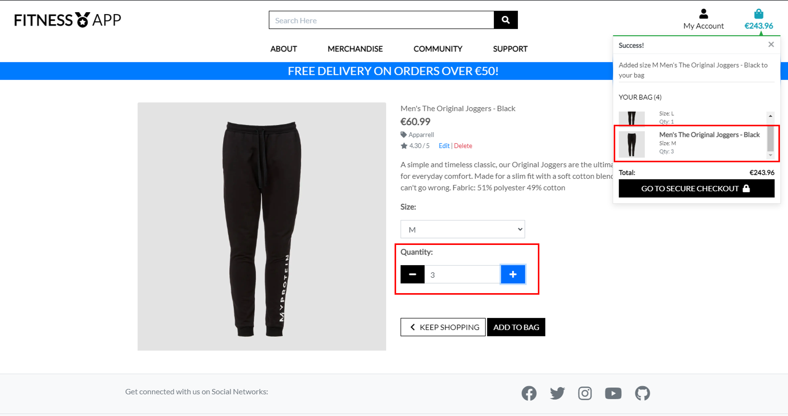   
  5 | Product Management | A Store Owner should be able to see an option for `Product Management` under their `My account` link - this should give Store Owners the ability to add new products to the store, specifying their details, and an image | Functionality operates as expected |Pass | 

  **Shopping bag testing**

  No. |Test Case | Expected Result | Actual Result | Pass/Fail | Link
 ------------- |------------- | ------------- | ------------ | ------------- | ------------- 
  1 | Add to Bag | Clicking the `add to bag` button under an product should add the item to the shopping bag | Functionality operates as expected | Pass | 
  2 | Quantity Selector | The quantity selector should work as intended, allowing the user to incrememnt and decrement the quantity for an individual product, and/or specify manually by typing a number | Functionality operates as expected | Pass | 
  3 | Remove button | Clicking the `remove` button under a product should remove the item from the shopping bag | Functionality operates as expected | Pass | 
  4 | Bag subtotal | The bag subtotal should calculate correctly for the user when there are items present in the bag | Functionality operates as expected | Pass | 
  5 | Delivery Cost calculator | The delivery cost subtotal should calculate correctly for the user when there are items present in the bag | Functionality operates as expected | Pass | 
  6 | Empty Bag | If the user navigates to the shopping bag when they have not selected any items to purchase, they should be presented with a `your bag is empty` screen to promote a positive UX | Functionality operates as expected | Pass | 
  7 | Secure Checkout Button | Clicking the `Secure Checkout` button on the shopping bag page shoould then bring the user to the Secure Checkout page | Functionality operates as expected | Pass | 

  **Checkout testing**

  No. |Test Case | Expected Result | Actual Result | Pass/Fail | Link
 ------------- |------------- | ------------- | ------------ | ------------- | ------------- 
  1 | Name, Delivery & Payment Details | The User should be presented with fields to enter their name, delivery and payment in the `details` section with placeholders specifying the required information | Functionality operates as expected | Pass | 
  2 | Adjust Bag button | Clicking the `adjust bag` button should return the user back to the shopping bag screen where they can make any changes they require, or progress back to the checkout screen | Functionality operates as expected | Pass | 
  3 | Order Summary | A summary of the user's order should be shown containing the products being purchased, the quantities, sizes and any delivery costs along with the order subtotal | Functionality operates as expected | Pass | 
  4 | Card Charge Reminder | An emphasized final warning of the amount the user's card is about to be charged should be displayed at the bottom under the `complete order` button | Functionality operates as expected | Pass | 
  5 | Complete Order Button | Clicking the `Complete Order` button should commence the Stripe transactions and have the user pay for their items - the blue processing screen should display for the user whilst the stripe transaction processing is occurring to promote a positive UX | Functionality operates as expected  |  Pass | 
  6 | Order Confirmation Screen | Upon successful completion of the Stripe API call and payment, the user should be presented with a summary of their order, including the order number, date, order details, and delivery details | Functionality operates as expected | Pass | 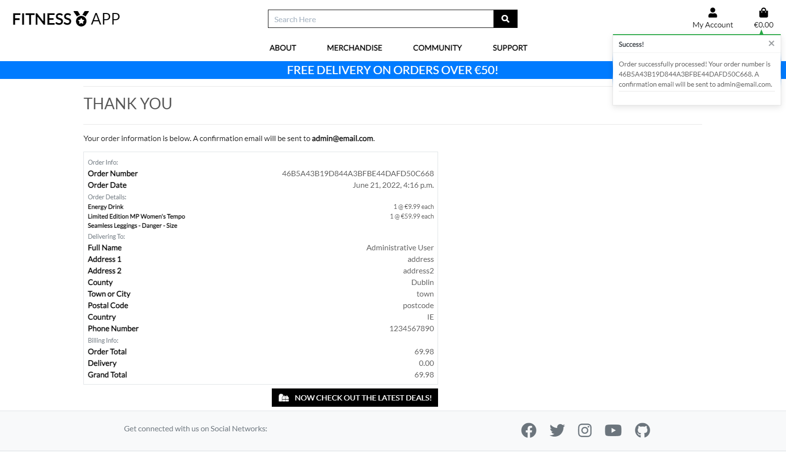
  7 | Order Confirmation email | A user should also receieve an email with their order details upon completion of the order | Functionality operates as expected | Pass | 

  **Support Application Testing:**

  No. |Test Case | Expected Result | Actual Result | Pass/Fail | Link
  ------------- |------------- | ------------- | ------------ | ------------- | ------------- 
  1 | Contact Us Form | The User should be presented with fields to enter their first and last names, email and the nature of their enquiry in the `Contact Us` form when clicking on the main nav menu option | Functionality operates as expected | Pass | 
  2 | Pre-population | If the user is logged in, their `First Name`, `Last Name`, and `Email` should pre-populate in the form to promote a positive User Experience | Functionality operates as expected | Pass | 
  3 | Confirmation Notification | The User should be presented with a `toast success` message upon completion and submission of the form, whilst also being redirected back to the application's home screen | Functionality operates as expected | Pass | 
  4 | Enquiry Log Access | User's with `Superuser` privileges should have an option to view the Support Application's `Enquiry Log` on their `My Account` dropdown menu | Functionality operates as expected | Pass | 
  5 | Enquiry Log Dashboard | User's with the appropriate credentials should be able to view a list of all of the enquiries submitetd to date via the Contact Us page | Functionality operates as expected | Pass | 
  6 | Enquiry Log Actions | Superusers should be able to mark individual enquiries as either `open` or `closed` depending on their status to aid store owners with managing the site | Functionality operates as expected | Pass | 

  **Community Application Testing:**

  No. |Test Case | Expected Result | Actual Result | Pass/Fail | Link
  ------------- |------------- | ------------- | ------------ | ------------- | ------------- 
  1 | Forum Authenication | The Discussion Forum should prompt Anonymous Users to login prior to being able to access the forum's topic display screen | Functionality operates as expected | Pass | 
  2 | Topics Overview | Upon logging in, a user should be presented with an overview of all of the currently active topics on the Topics Overview Screen | Functionality operates as expected | Pass |   
  3 | Create  A Topic | The Forum should allow authenticated users to create a new topic if they wish by clicking on the `Start New Topic` button - this should open a topic creation form for the user to specify the Topic title | Functionality operates as expected | Pass | 
  4 | Edit a Topic| Whilst viewing the Topics Listing page, a user should have the option to edit any Topics they have previously added to the discussion by clicking on the `Edit Topic` button - this should bring the user to a form allowing them to edit their Topic Title and submit back to the forum | Functionality operates as expected | Pass | 
  5 | Delete a Topic| Whilst viewing the Topics listing page, a user should have the option to delete any topics they have previously added to the discussion by clicking on the `Delete Topic` button - this should allow the user to permanently delete the Topic, and all associated comments and replies currently left on the Topic | Functionality operates as expected | Pass | 
  6 | Topic Detail | When a user clicks on a paticular topic, they should be brought to the Topic Detail screen, showing a list of the comments and replies currently present on the topic | Functionality operates as expected | Pass | 
  7 | Add a comment| Whilst viewing the Topic Detail page, a user should have the option to add a new comment to the discussion by clicking on the `Add a comment` button - this should bring the user to a form allowing them to add the content of their new comment and submit to the forum | Functionality operates as expected | Pass | 
  8 | Edit a comment| Whilst viewing the Topic Detail page, a user should have the option to edit any comments they have previously added to the discussion by clicking on the `Edit comment` button - this should bring the user to a form allowing them to edit the content of their comment and submit | Functionality operates as expected | Pass | 
  9 | Delete a comment| Whilst viewing the Topic Detail page, a user should have the option to delete any comments they have previously added to the discussion by clicking on the `Delete Comment` button - this should allow the user to permanently delete the comment | Functionality operates as expected | Pass | 
  10 | Add a reply| Whilst viewing the Topic Detail page, a user should have the option to add a reply to any existing comment in the discussion by clicking on the `Reply` button - this should bring the user to a form allowing them to add the content of their new reply and submit to the forum | Functionality operates as expected | Pass | 
  11 | Edit a reply| Whilst viewing the Topic Detail page, a user should have the option to edit any replies they have previously added to the discussion by clicking on the `Edit Reply` button - this should bring the user to a form allowing them to edit the content of their Reply and submit | Functionality operates as expected | Pass | 
  12 | Delete a Reply| Whilst viewing the Topic Detail page, a user should have the option to delete any replies they have previously added to the discussion by clicking on the `Delete Reply` button - this should allow the user to permanently delete the Reply | Functionality operates as expected | Pass | 
  13 | User Activity | A user should have the option to view a history of their contributions & forum activity by clicking on the `My Activity` link - this should show the user's previously created Topics, Comments, and Replies together with permitted CRUD actions on each element | Functionality operates as expected | Pass | 

## 2. Browser Compatibility Testing:

The site's compatibility with different browsers and device sizes has been extensively tested to help ensure the best positive experience for site users & visitors, with some of the primary browser & device-size compatibility screenshots being displayed below:

### Google Chrome 

### Microsoft Edge

### Mozilla Firefox

### Android (Galaxy S10)

### Safari (Ipad)

## 3. Lighthouse Testing (Accessbility, SEO, Performance):

The DevTools suite, and Lighthouse were used to audit the site's accessibility and found the only initial accessibility deficiencies in the site were generally driven by Search Engine Optimisation and in some cases, accessibility. The finalized accessibility scoring for each page in the site are shown below with the results of the focus on meeting accessbility guidelines ensuring all scores green and in the 90%-100% range.

Website Page | Performance | Accessibility | Best practices | SEO | Screenshot
  ------------- |------------- | ------------- | ------------ | ------------- | ------------- 
  Home Page | 99 | 93 | 92 | 100 | 
  Register | 99 | 93 | 92 | 100 | 
  Log In | 99 | 93 | 92 | 100 | 
  Log Out | 99 | 93 | 92 | 100 | 
  About Us | 100 | 93 | 92 | 100 | 
  Merchandise | 100 | 93 | 92 | 100 | 
  Contact | 99 | 93 | 92 | 100 | 
  Forum Overview | 98 | 93 | 92 | 100 | 
  Forum User Activity | 99 | 93 | 92 | 89 | 
  

## 4. Compliance Testing:

### HTML validation

All HTML pages have been passed through the official W3C validator without any issues, (with the exception of the article detail page - see context below) with accompanying screenshots of the output below:

- Home Page:

- Register:

- Log In:

- About Us:

- Merchandise:

- Contact Us:

- Forum Overview:

Please note the Forum screens cannot be validated by URL as they require authentication, these screens have been validated by direct input. Please see the [screenshot](readme/testing/w3c_forum_extended.png) attached for the extended code validation.

- Forum User Activity:

Please note similar to above, the Forum Activity screens cannot be validated by URL as they require authentication, these screens have been validated by direct input. Please see the [screenshot](readme/testing/w3c_forum_activity_extended.png) attached for the extended code validation.

### CSS validation

The site's CSS code has been successfully validated using the Jigsaw CSS validation service, with no errors found, and only two types of warnings found which do not affect the site content and can be safely ignored per the screenshot below:

- base.css

- checkout.css

- profile.css

- forum.css

### Javascript Validation

The site's Javascript code has been successfully validated using the JSHint validation service, with no errors found, and only one warning regarding an undefined variable which does not affect the site content and is required in order to enable the messaging functionality to operate:

- Stripe Elements:

- Country Field:

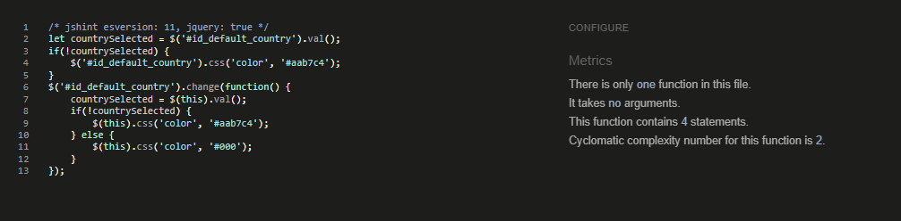

### Python Validation

This section will summarise the Python validation activities carried out across the various python files consisting the structure of the application, using the [PEP8 Online Check](http://pep8online.com/) utility:

#### **(a) Bag Application:**

No. |Python File | PEP8 Status | Screenshot 
------------- |------------- | ------------- | ------------ 
1 | [apps.py](bag/apps.py) | No issues | 
2 | [contexts.py](bag/contexts.py) | No issues | 
3 | [urls.py](bag/urls.py) | No issues | 
4 | [views.py](bag/views.py) | No issues | 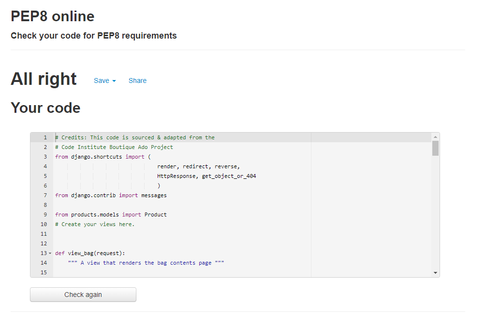

#### **(b) Checkout Application:**

No. |Python File | PEP8 Status | Screenshot 
------------- |------------- | ------------- | ------------ 
1 | [admin.py](checkout/admin.py) | No issues | 
2 | [apps.py](checkout/apps.py) | No issues | 
3 | [models.py](checkout/forms.py) | No Issues | 
4 | [models.py](checkout/models.py) | No Issues | 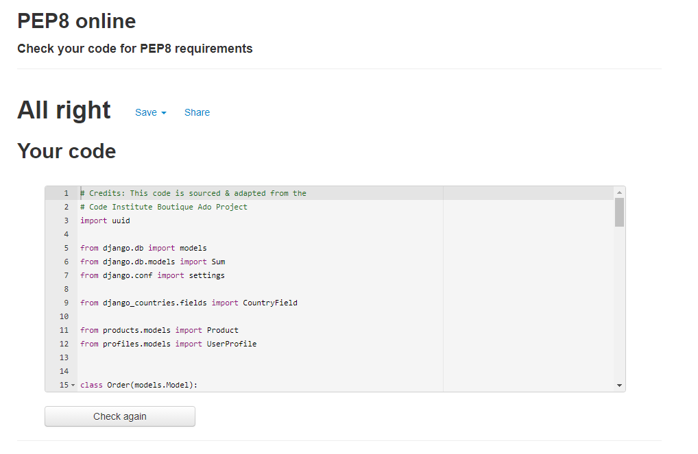
5 | [signals.py](checkout/signals.py) | No issues  | 
6 | [urls.py](checkout/urls.py) | No issues | 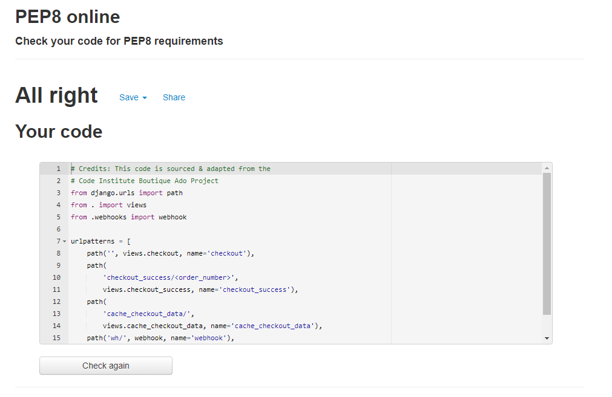
7 | [views.py](checkout/views.py) | No issues | 
8 | [webhook_handler.py](checkout/webhook_handler.py) | No issues | 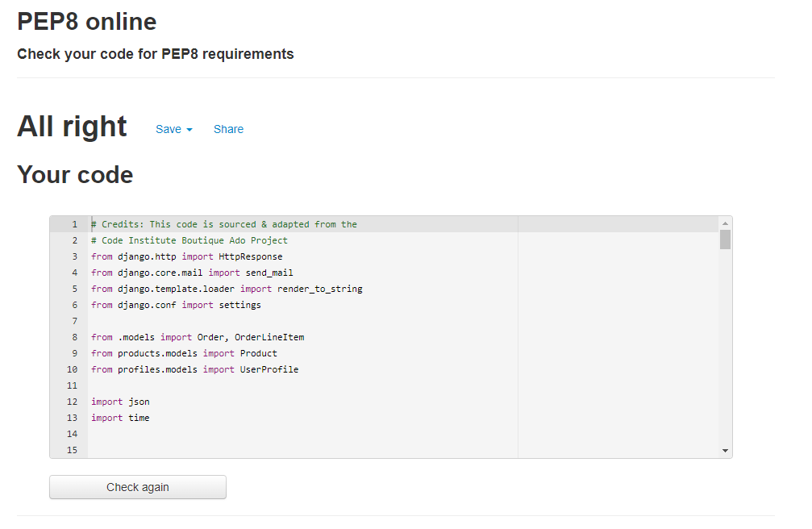
9 | [webhooks.py](checkout/webhooks.py) | No issues | 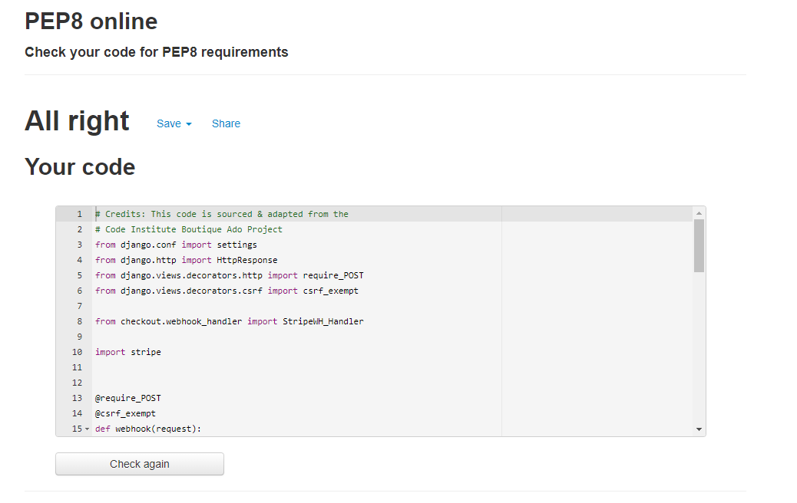

#### **(c) Contact Application:**

No. |Python File | PEP8 Status | Screenshot 
------------- |------------- | ------------- | ------------ 
1 | [admin.py](contact/admin.py) | No Issues | 
2 | [apps.py](contact/apps.py) | No Issues | 
3 | [forms.py](contact/forms.py) | No Issues | 
4 | [models.py](contact/models.py) | No Issues | 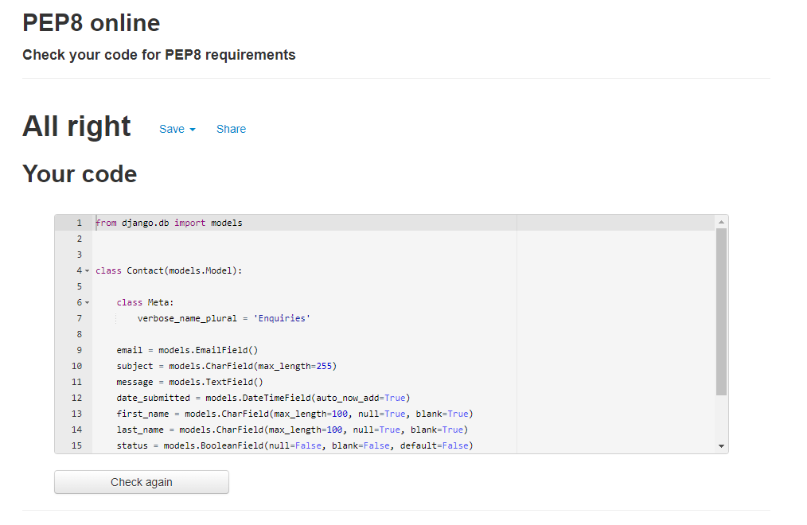
5 | [urls.py](contact/urls.py) | No Issues | 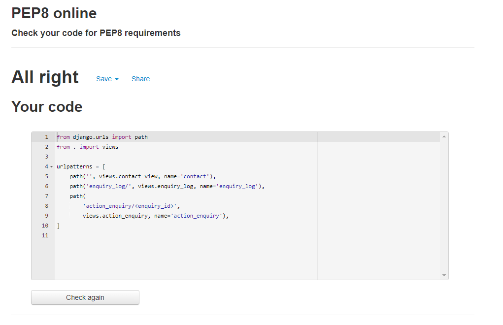
6 | [views.py](contact/views.py) | No Issues | 

#### **(d) Discussion Forum Application:**

No. |Python File | PEP8 Status | Screenshot 
------------- |------------- | ------------- | ------------ 
1 | [admin.py](discussion_forum/admin.py) | No Issues | 
2 | [apps.py](discussion_forum/apps.py) | No Issues | 
3 | [forms.py](discussion_forum/forms.py) | No Issues | 
4 | [models.py](discussion_forum/models.py) | No Issues  | 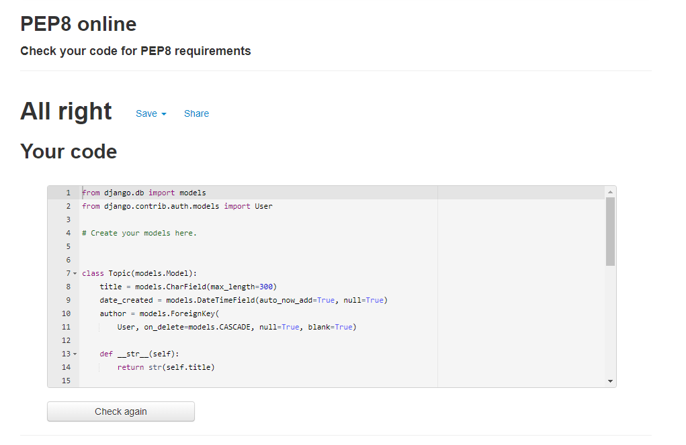
5 | [urls.py](discussion_forum/urls.py) | No Issues | 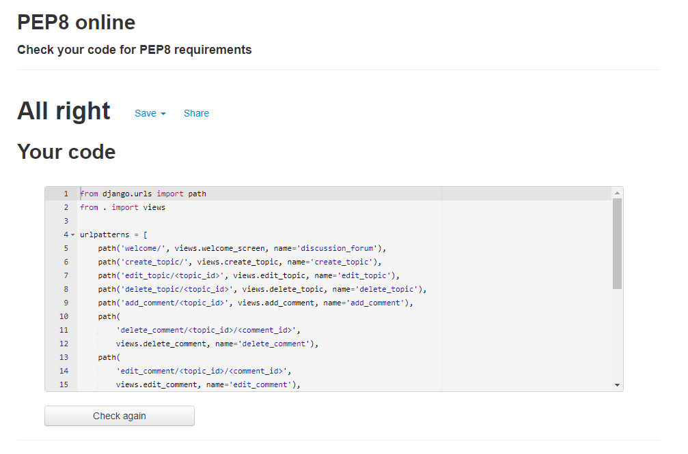
6 | [views.py](discussion_forum/views.py) | No Issues | 

#### **(e) Main Project Directory:**

No. |Python File | PEP8 Status | Screenshot 
------------- |------------- | ------------- | ------------ 
1 | [settings.py](fitness_app/settings.py) | No Issues | 
2 | [urls.py](fitness_app/urls.py) | No issues | 
3 | [views.py](fitness_app/views.py) | No issues | 

#### **(f) Home Application:**

No. |Python File | PEP8 Status | Screenshot 
------------- |------------- | ------------- | ------------ 
1 | [apps.py](home/apps.py) | No issues | 
2 | [urls.py](home/urls.py) | No issues | 
3 | [views.py](home/views.py) | No issues | 

#### **(g) Newsletter Application:** 

No. |Python File | PEP8 Status | Screenshot 
------------- |------------- | ------------- | ------------ 
1 | [admin.py](newsletter/admin.py) | No issues | 
2 | [apps.py](newsletter/apps.py) | No issues | 
3 | [forms.py](newsletter/forms.py) | No issues | 
4 | [models.py](newsletter/models.py) | No issues | 

#### **(h) Products Application:** 

No. |Python File | PEP8 Status | Screenshot 
------------- |------------- | ------------- | ------------ 
1 | [admin.py](products/admin.py) | No issues | 
2 | [apps.py](products/apps.py) | No issues | 
3 | [forms.py](products/forms.py) | Line Length too long x1 | 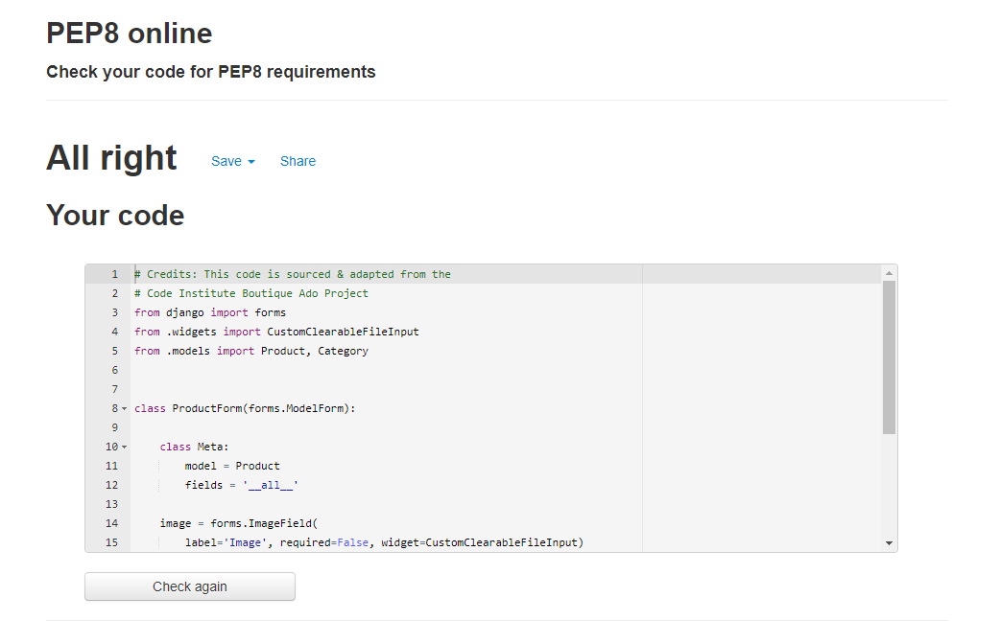
4 | [models.py](products/models.py) | Line Length too long x3 | 
5 | [urls.py](products/urls.py) | Line Length too long x2 | 
6 | [views.py](products/views.py) | Line Length too long x7 | 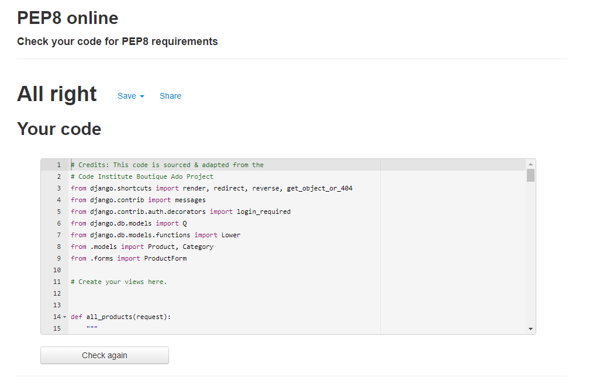
7 | [widgets.py](products/widgets.py) | Line Length too long x1 | 

#### **(i) Profiles Application:** 

No. |Python File | PEP8 Status | Screenshot 
------------- |------------- | ------------- | ------------ 
1 | [apps.py](profiles/apps.py) | No issues | 
2 | [forms.py](profiles/forms.py) | Line Length x1 | 
3 | [models.py](profiles/models.py) | Line Length x5 | 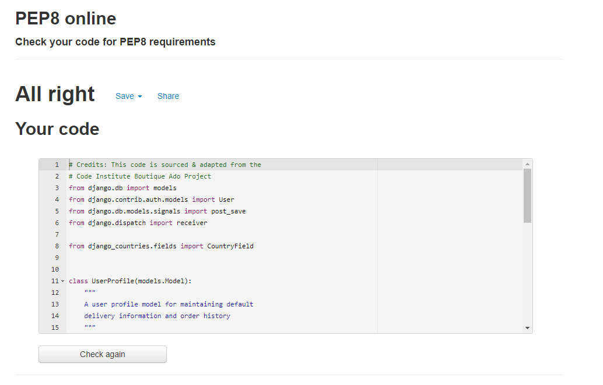
4 | [urls.py](profiles/urls.py) | Line Length x1 | 
5 | [views.py](profiles/views.py) | Line Length x1 | 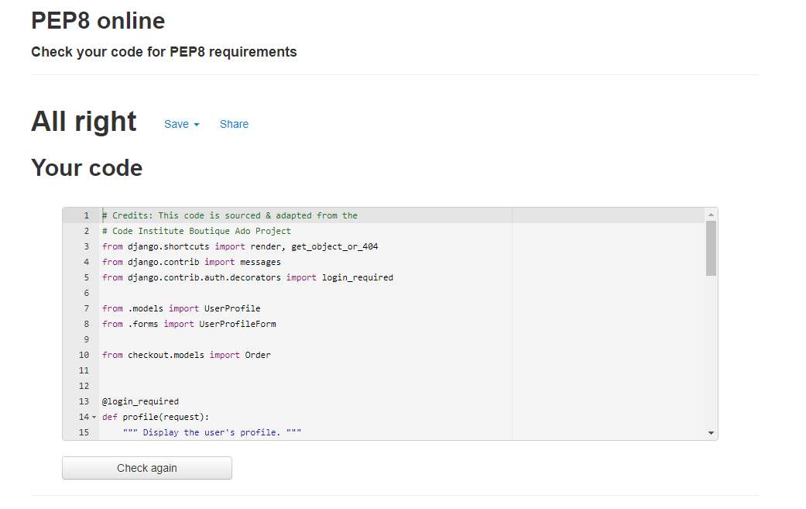

